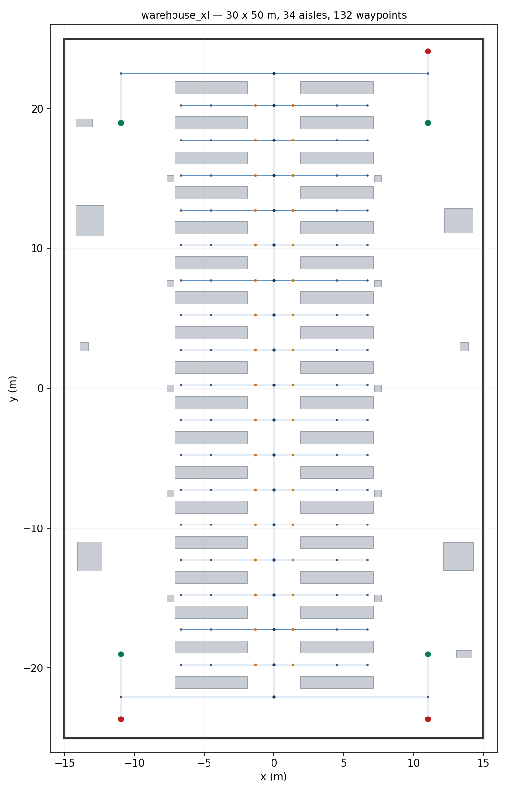
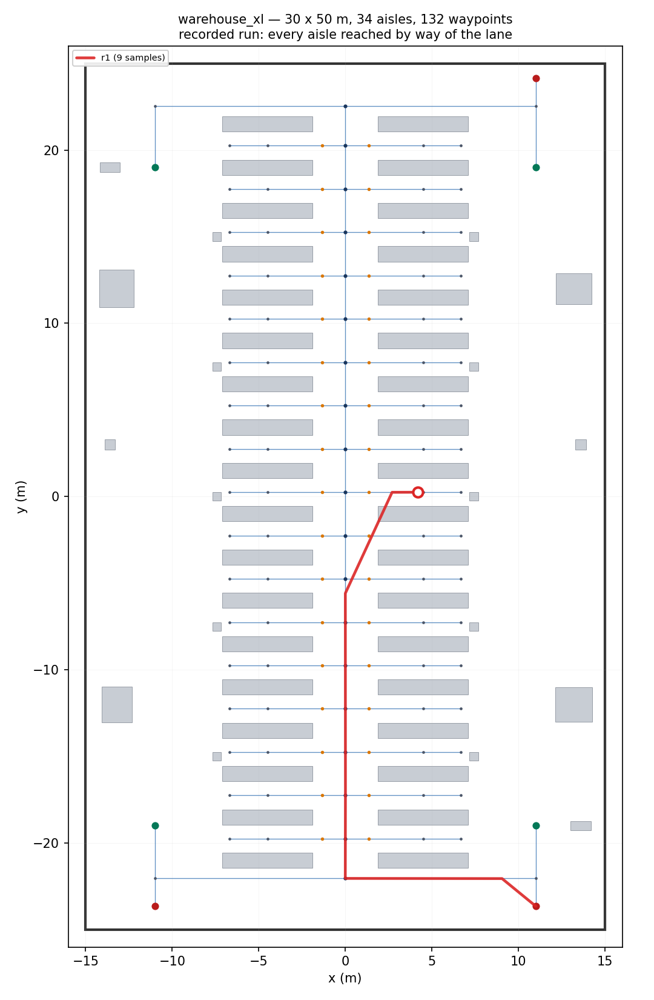

# Epistemic-Robotics

Multi-agent task planning under partial observability, grounded in Dynamic Epistemic Logic. Each agent maintains a Kripke model of the environment: a set of possible worlds, a per-agent accessibility relation, and a designated subset standing for the situation as far as that agent can tell. Actions are epistemic events applied by product update rather than state transitions, and a goal may require that an agent reach a zone or that it *know* it has reached it. Route planning is the winning region of a µ-calculus fixed point over the occupancy graph rather than a geometric shortest path.

Validation is in simulation. Robots are URDF descriptions under ROS 2 and Gazebo; hardware is out of scope.

## Fixed points over partial maps

A cell that has never been observed is excluded from the reachability computation, since unknown is not free. The least fixed point therefore halts at the mouth of an unobserved corridor and reports no route. A sensing action resolves those cells, and the same computation then runs to completion.

| | |
| --- | --- |
|  |  |

**Figure 1.** Least fixed point before and after a sensing action. Cells marked `?` are unobserved.

When two goals must both be reached, the plan is a tree rather than a sequence: a shared approach followed by a branch, each subtree the winning region of its own reachability formula.

<p align="center">
  <br>
  <sub><b>Figure 2.</b> Branching plan over two targets.</sub>
</p>

The dual computation bounds where an agent may go rather than where it can arrive. The greatest fixed point retains the cells that remain within the known-free region under every step; its boundary is the exploration frontier, and the frontier is where a further sensing action is worth spending.

<p align="center">
  <br>
  <sub><b>Figure 3.</b> Safe known region and exploration frontier.</sub>
</p>

## A warehouse to run it on

The world the RoboticsAcademy [multi-robot Amazon warehouse
exercise](https://jderobot.github.io/RoboticsAcademy/exercises/MobileRobots/multi_robot_amazon_warehouse/)
runs on — AWS RoboMaker's small warehouse — restated so that what the robots do
not know is part of the map. Not a floor plan that resembles it: the grid is
rasterised from the collision meshes Gazebo uses for that world, and the demo
launches that world unmodified, so the racks the planner drives around are the
racks the laser hits.

What the exercise asks for is a centralised task planner that assigns the jobs;
it is simply told where the pallet is. Here that is the whole problem. A part
of the floor nobody has measured is unknown rather than free, and which aisle
holds the pallet is a disagreement between two worlds one robot can tell apart
and another cannot.

```bash
ros2 launch warehouse_demo warehouse_demo_launch.py   # the mission, executed
bash scenarios/warehouse/run_demo.sh                  # cells: routes and where to look
bash epddl-workspace/robot-warehouse/validate.sh      # zones: what must be known
```

The first drives the policy in Gazebo through ePlanSys on PlanSys2, with
SLAM Toolbox building the map the µ-calculus planner routes over. The second
runs six questions past that planner, twice each — once in process and once
over ROS topics — and fails if the two answers differ. The third grounds the
warehouse domain with plank, solves it with Aletheia into a branching policy,
and prints the pointed model, the goal, the actions and the plan for one agent
and then for two — followed by two plans that must be rejected.

Written up in [`scenarios/warehouse/README.md`](scenarios/warehouse/README.md)
(the map and the routes) and
[`epddl-workspace/robot-warehouse/README.md`](epddl-workspace/robot-warehouse/README.md)
(the domain and the policies).

### A larger floor

The small warehouse is 14 by 21 metres with two aisles, which is enough to show
the pipeline works and not enough to show it scaling.
[`warehouse_xl_rmf_demo`](ros2_ws/src/warehouse_xl_rmf_demo) is 30 by 50 metres
with thirty-four, a service lane running the length of the building, and three
robots under Open-RMF.

| | small | larger |
| --- | --- | --- |
| floor | 14 × 21 m, 296 m² | 30 × 50 m, 1 500 m² |
| aisles | 2 | 34 |
| waypoints | 12 | 132 |
| directed lanes | 11 | 262 |
| robots | 2 | 3 |

```bash
ros2 launch warehouse_xl_rmf_demo warehouse_xl_fleet.launch.py
ros2 run eplansys_rmf_probe submit_probe -F warehouseXL -R r1 -p east_08
```

It is built rather than downloaded because no large warehouse map for Open-RMF
exists to download. Measured against their own meshes rather than their
descriptions, the candidates each fail differently: `OpenRobotics/Depot` is the
one usually reached for and collides with nothing but the floor, so a plan
rasterised from it comes back empty; `OpenRobotics/Warehouse` is genuinely 30 by
50 and is an empty box, 1.2% occupied at robot height and all of that pillars.
The largest maps in `rmf_demos`, the airport terminal and the campus, are not
warehouses. So the hall is the Fuel model, whose collision mesh is the building,
and the shelving is AWS RoboMaker's, whose racks a laser can see.

The arrangement keeps the property the approach needs. Every aisle opens onto
the one service lane and onto nothing else, so an aisle cannot be seen into
until a robot stands at its mouth — the same reason the least fixed point halts
at an unobserved corridor above. A larger open hall would have been a longer
demonstration of a weaker claim.

Everything is generated from
[`tools/layout.py`](ros2_ws/src/warehouse_xl_rmf_demo/tools/layout.py): the
world, the navigation graph and the building map, so none of them can drift
from the others. Every waypoint and lane is checked against the floor before it
is written, and the check refused three layouts that looked right — aisle ends
meeting the pillar row, a cross aisle that ran through the last row of shelving
once the row count changed, and two robots nominating one charger.

The fourth it did not refuse, and that is the one worth recording. A pallet
jack placed at the south dock purely for the look of it overlapped the lane out
of the east charger by twenty centimetres. The check passed, because it knew
about racks and pillars and not about props; RMF reported the task underway;
and the robot drove out of its charger, pressed into the pallet jack and
stopped, with nothing anywhere reporting a collision. Props are part of the
floor definition now, and the same check that missed it rejects it.

<p align="center">
  <br>
  <sub><b>Figure 4.</b> The floor. Grey is rack and pillar, blue the navigation
  graph, orange the aisle mouths; green the docks and red the chargers in the
  outer bays. Thirty-four aisles, and each one meets the graph only at its
  mouth on the central lane.</sub>
</p>

The claim that an aisle can only be entered from the lane is worth measuring
rather than asserting, so a run is recorded from `/fleet_states` and drawn over
the graph it was routing on.

<p align="center">
  <br>
  <sub><b>Figure 5.</b> r1 from <code>charger_east_south</code> to aisle
  <code>east_08</code>: 35.9 m of path for 25 m of separation, in 96 s. Out of
  the charger, west along the south cross aisle, twenty-two metres north up the
  service lane, then east into the aisle. The detour is the point — the racks
  leave no way in but the lane.</sub>
</p>

```
  t=0s   (11.00, -23.64)  charger_east_south
  t=12s  ( 9.06, -22.05)  onto the south cross aisle
  t=24s  ( 3.29, -22.04)  west along it, ~0.58 m/s
  t=36s  ( 0.00, -22.04)  lane_00, the foot of the service lane
  t=48s  ( 0.01, -16.86)  north up the lane
  t=60s  ( 0.01, -11.35)
  t=72s  ( 0.00,  -5.59)
  t=84s  ( 2.70,   0.25)  turned east at the mouth of aisle 8
  t=96s  ( 4.19,   0.25)  east_08
```

The samples are in
[`docs/r1_run.csv`](ros2_ws/src/warehouse_xl_rmf_demo/docs/r1_run.csv);
`tools/record_run.py` writes them, and `tools/plot_floor.py --run` draws them.
The trace is r1's. All three robots run, and three tasks pinned to three
robots were accepted and executed concurrently with no process failures; how
RMF's schedule mediates the lane under sustained three-robot traffic — the one
resource all thirty-four aisles share — has not been measured yet.

## Components

| Component | Role |
| --- | --- |
| [Aletheia](https://github.com/HanielUlises/Aletheia) | Epistemic planner. Heuristic search over pointed Kripke models under S5 and KD45 frames. |
| [plank](https://github.com/a-burigana/plank) | EPDDL parsing, type checking and grounding. Produces the tasks the planner reads. |
| [eplansys](https://github.com/ePlanSys/eplansys) | Execution layer on ROS 2, built on PlanSys2. Runs a policy and holds the epistemic state. |
| [SLAM Toolbox](https://github.com/SteveMacenski/slam_toolbox) | 2D mapping. Each robot's occupancy grid. |
| [Nav2](https://github.com/ros-navigation/navigation2) | Navigation. Executes the ontic actions of a plan. |

This repository holds what is specific to the work: the simulated fleet and its worlds, the collaborative layer that tracks which regions each robot has observed and reconciles two maps when a link is restored, µ-calculus route planning, the warehouse scenario, and the experiments. The EPDDL domains and instances are under `epddl-workspace/`. Papers and the project site are on the `gh-pages` branch.
