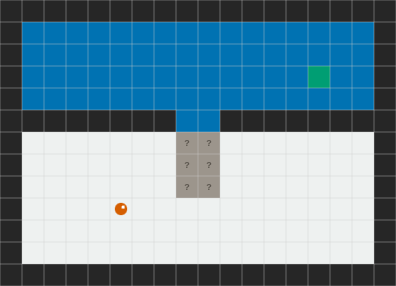
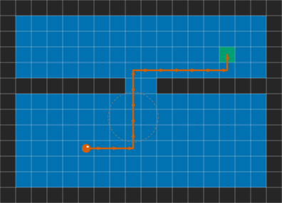
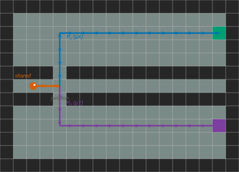
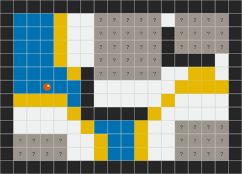

# Epistemic-Robotics

Multi-agent task planning under partial observability, grounded in Dynamic Epistemic Logic. Each agent maintains a Kripke model of the environment: a set of possible worlds, a per-agent accessibility relation, and a designated subset standing for the situation as far as that agent can tell. Actions are epistemic events applied by product update rather than state transitions, and a goal may require that an agent reach a zone or that it *know* it has reached it. Route planning is the winning region of a µ-calculus fixed point over the occupancy graph rather than a geometric shortest path.

Validation is in simulation. Robots are URDF descriptions under ROS 2 and Gazebo; hardware is out of scope.

## Fixed points over partial maps

A cell that has never been observed is excluded from the reachability computation, since unknown is not free. The least fixed point therefore halts at the mouth of an unobserved corridor and reports no route. A sensing action resolves those cells, and the same computation then runs to completion.

| | |
| --- | --- |
|  |  |

**Figure 1.** Least fixed point before and after a sensing action. Cells marked `?` are unobserved.

When two goals must both be reached, the plan is a tree rather than a sequence: a shared approach followed by a branch, each subtree the winning region of its own reachability formula.

   
  <b>Figure 2.</b> Branching plan over two targets.

The dual computation bounds where an agent may go rather than where it can arrive. The greatest fixed point retains the cells that remain within the known-free region under every step; its boundary is the exploration frontier, and the frontier is where a further sensing action is worth spending.

   
  <b>Figure 3.</b> Safe known region and exploration frontier.

## Components

| Component | Role |
| --- | --- |
| [Aletheia](https://github.com/HanielUlises/Aletheia) | Epistemic planner. Heuristic search over pointed Kripke models under S5 and KD45 frames. |
| [plank](https://github.com/a-burigana/plank) | EPDDL parsing, type checking and grounding. Produces the tasks the planner reads. |
| [eplansys](https://github.com/ePlanSys/eplansys) | Execution layer on ROS 2, built on PlanSys2. Runs a policy and holds the epistemic state. |
| [SLAM Toolbox](https://github.com/SteveMacenski/slam_toolbox) | 2D mapping. Each robot's occupancy grid. |
| [Nav2](https://github.com/ros-navigation/navigation2) | Navigation. Executes the ontic actions of a plan. |

This repository holds what is specific to the work: the simulated fleet and its worlds, the collaborative layer that tracks which regions each robot has observed and reconciles two maps when a link is restored, µ-calculus route planning, and the experiments. The EPDDL domains and instances are under `epddl-workspace/`. Papers and the project site are on the `gh-pages` branch.
