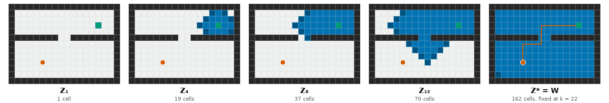
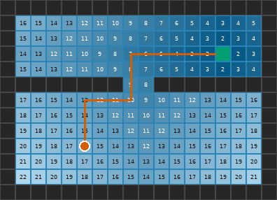
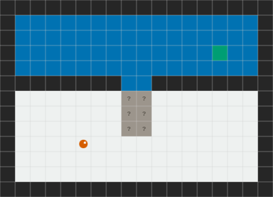
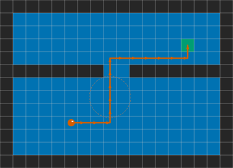
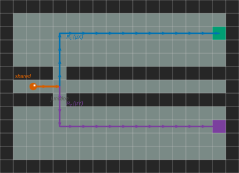
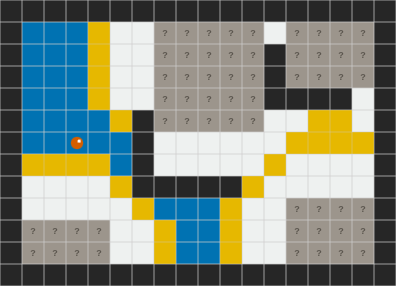
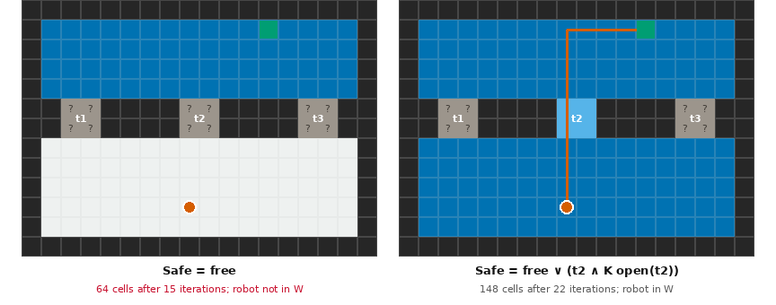
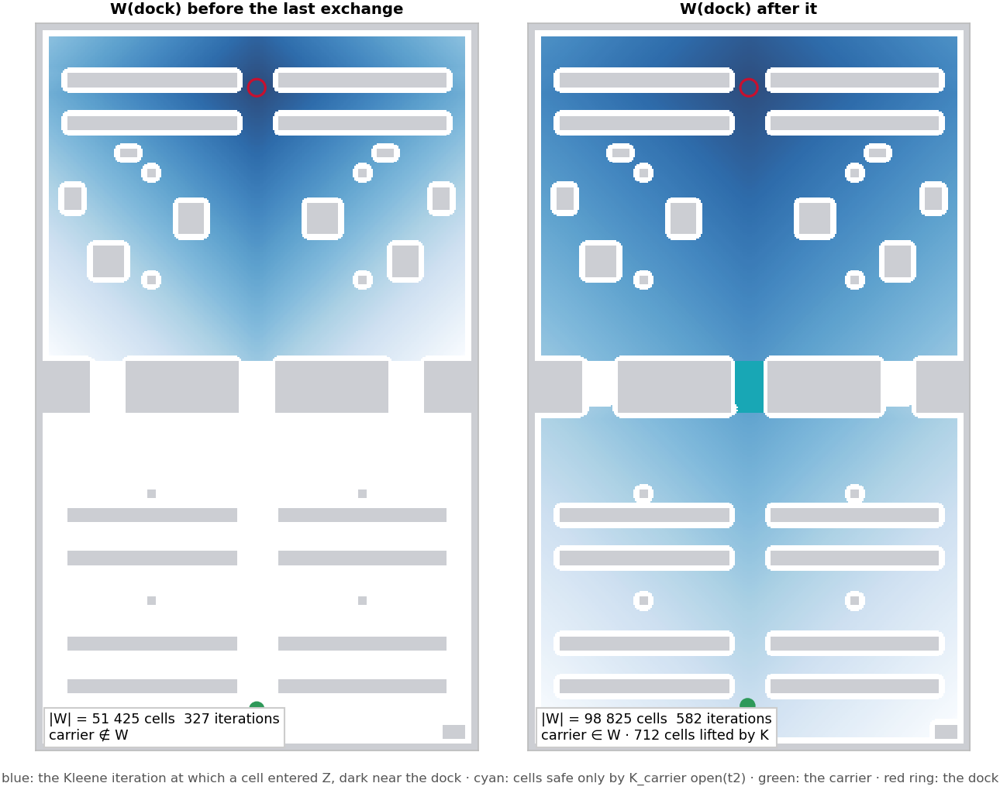
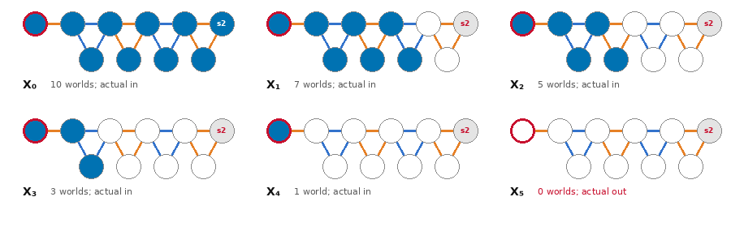

# Epistemic-Robotics

Multi-agent task planning under partial observability, grounded in Dynamic Epistemic Logic. Each agent maintains a Kripke model of the environment: a set of possible worlds, a per-agent accessibility relation, and a designated subset standing for the situation as far as that agent can tell. Actions are epistemic events applied by product update, not state transitions, and a goal may require that an agent reach a zone or that it *know* it has reached it. Route planning is the winning region of a µ-calculus fixed point over the occupancy graph, not a geometric shortest path.

Validation is in simulation. Robots are URDF descriptions under ROS 2 and Gazebo; hardware is out of scope. Every run is filmed and written up on the [project site](https://hanielulises.github.io/Epistemic-Robotics/).

## Routes are least fixed points

The occupancy grid is a transition system: its states are cells, and its one modality $\Diamond$ is a move to a 4-connected neighbour. The cells from which a goal can be reached without leaving a safe set are the winning region

```math
W \;=\; \mu Z.\; \mathit{goal} \;\lor\; (\mathit{Safe} \land \Diamond Z),
\qquad Z_0 = \varnothing,\quad Z_{k+1} = \mathit{goal} \cup \{\, v \in \mathit{Safe} \mid \exists u \in Z_k,\ v \to u \,\}
```

computed by Kleene iteration until $Z_{k+1} = Z_k$. A robot has a route exactly when it stands in $W$.

<p align="center">
  <br>
  <sub><b>Figure 1.</b> The approximants Z₁, Z₄, Z₈, Z₁₂ and the fixed point, reached at k = 22. Dark cells entered at the step shown.</sub>
</p>

The iteration is also the route. A cell that entered at step $k$ has a neighbour that entered at $k - 1$, so the path descends the index to the goal, and its length is the index at the start.

<p align="center">
  <br>
  <sub><b>Figure 2.</b> W labelled by the iteration at which each cell entered it. The robot entered at 16; the route takes 15 steps down.</sub>
</p>

## Unknown is not free

A cell that has never been observed is in no safe set. The least fixed point therefore halts at the mouth of an unobserved corridor and reports no route. A sensing action resolves those cells, and the same computation then runs to completion.

| | |
| --- | --- |
|  |  |

**Figure 3.** The fixed point before and after a sensing action. Cells marked `?` are unobserved.

When two goals must both be reached the plan is a tree: a shared approach followed by a branch, each subtree the winning region of its own formula. The dual computation bounds where an agent may go: the greatest fixed point keeps the cells from which every step stays in the known-free region, and its boundary is the exploration frontier, where a further sensing action is worth spending.

| | |
| --- | --- |
|  |  |

**Figure 4.** A branching plan over two targets, and the safe known region with its frontier.

## Knowledge in the safe set

The safe set need not be geometric. Evaluated at every pair of a cell and a world of the Kripke model the executor maintains, an epistemic formula can admit a cell because an agent *knows* something about it:

```math
\mathit{Safe}_i \;=\; \Big[\!\Big[\; \mathit{free} \;\lor\; \bigvee_{t} \big(t \land K_i\, \mathit{open}(t)\big) \Big]\!\Big]
```

A bay nobody has seen is not free. It enters the fixed point when the agent comes to know it is open, which it can do without seeing it: told that the other two bays are shut, it knows the third is open by elimination.

<p align="center">
  <br>
  <sub><b>Figure 5.</b> The same floor and the same fixed point, before and after K open(t₂). The lifted cells are drawn in light blue.</sub>
</p>

On the 30 by 50 metre pass-through floor the same computation, evaluated by `mu_path_planner` over the model the epistemic state published, stops at the racking after 327 iterations and, one announcement later, runs 582 and reaches the carrier through a bay no robot surveyed and no map contains.

<p align="center">
  <br>
  <sub><b>Figure 6.</b> W(dock) from a run of <a href="ros2_ws/src/pass_through_demo"><code>pass_through_demo</code></a>, coloured by iteration. Cyan: cells safe only by K<sub>carrier</sub> open(t₂).</sub>
</p>

## Common knowledge is a greatest fixed point

The other fixed point the project depends on is in the logic itself. With $E_G\varphi$ for "every agent of $G$ knows $\varphi$",

```math
C_G\,\varphi \;=\; \nu X.\; E_G(\varphi \land X),
\qquad X_0 = W,\quad X_{k+1} = [\![\, E_G(\varphi \land X_k) \,]\!]
```

and the approximants from above are the worlds at which $E_G^1\varphi, \dots, E_G^k\varphi$ all hold. A message over a channel that can lose it keeps the actual world in at most one further approximant, whether or not it arrives, so no number of messages puts it in the fixed point. In the coordinated attack two robots must lift one load together and `lift(s)` requires $C_G\,\mathit{job}(s)$; four delivered radio messages leave the actual world in $X_4$ and out of $X_5$, the greatest fixed point is empty, and the executor refuses the lift. A beacon both robots are known to see is a public announcement, after which one world remains, and it is in every $X_k$.

<p align="center">
  <br>
  <sub><b>Figure 7.</b> X₀, …, X₅ on the model the radio protocol leaves after four messages: 10, 7, 5, 3, 1 and 0 worlds. Edges are the two robots' relations; <code>s2</code> marks the world where the order names the other stand.</sub>
</p>

## Demonstrations

| package | question | written up |
| --- | --- | --- |
| [`eplansys_rooms_demo`](ros2_ws/src/eplansys_rooms_demo), [`demo/`](demo) | a survey of six rooms whose goal is knowledge, and the fixed point that routes it | [six-room run](https://hanielulises.github.io/Epistemic-Robotics/demo.html), [survey](https://hanielulises.github.io/Epistemic-Robotics/six_room_survey.html) |
| [`warehouse_demo`](ros2_ws/src/warehouse_demo), [`scenarios/warehouse`](scenarios/warehouse) | the RoboticsAcademy Amazon warehouse, where which bay holds the pallet is unknown; the floor rasterised from Gazebo's collision meshes | [warehouse run](https://hanielulises.github.io/Epistemic-Robotics/warehouse_run.html), [nested goals](https://hanielulises.github.io/Epistemic-Robotics/nested_run.html) |
| [`warehouse_rmf_demo`](ros2_ws/src/warehouse_rmf_demo) | the same mission over an Open-RMF fleet | [over Open-RMF](https://hanielulises.github.io/Epistemic-Robotics/warehouse_rmf.html) |
| [`warehouse_xl_rmf_demo`](ros2_ws/src/warehouse_xl_rmf_demo) | a 30 by 50 m floor with thirty-four aisles, and three survey sites of which one is never visited | [at scale](https://hanielulises.github.io/Epistemic-Robotics/warehouse_xl.html), [three sites](https://hanielulises.github.io/Epistemic-Robotics/warehouse_xl_sites.html) |
| [`hotel_rmf_demo`](ros2_ws/src/hotel_rmf_demo) | a leak on one of two floors, where the frame leaves S5 during the run | [hotel incident](https://hanielulises.github.io/Epistemic-Robotics/hotel_run.html) |
| [`hotel_distributed_demo`](ros2_ws/src/hotel_distributed_demo) | the same hotel, a room that is distributed knowledge of two fleets, robots that can tell each other only where they meet, and an all-clear that would tell the guest the room; four fleets of one planner, and only the epistemic one meets the goal | [knowledge no robot holds alone](https://hanielulises.github.io/Epistemic-Robotics/hotel_distributed.html) |
| [`epistemic_comm`](ros2_ws/src/epistemic_comm) | a radio link that actually falls, and the belief each robot keeps of the other | [link outage](https://hanielulises.github.io/Epistemic-Robotics/link_outage.html) |
| [`pass_through_demo`](ros2_ws/src/pass_through_demo) | knowledge from the maps the robots build, and a carrier that crosses a bay no map contains | [pass-through](https://hanielulises.github.io/Epistemic-Robotics/pass_through.html) |
| [`coordinated_attack_demo`](ros2_ws/src/coordinated_attack_demo) | common knowledge as the precondition of a joint lift: a lossy radio cannot supply it, a beacon can, for two robots or four, and what each level of mutual knowledge costs in messages | [coordinated attack](https://hanielulises.github.io/Epistemic-Robotics/coordinated_attack.html) |
| [`muddy_robots_demo`](ros2_ws/src/muddy_robots_demo) | the muddy children at a muster point in the AWS small warehouse: an announcement every robot already knew makes it common knowledge, and only then does a bell at which nobody moves carry information | [muddy robots](https://hanielulises.github.io/Epistemic-Robotics/muddy_robots.html) |
| [`stale_map_demo`](ros2_ws/src/stale_map_demo) | eight robots whose maps go stale while each sees at most one of two changes: a received map as an update, sent only where a robot believes the receiver's is stale; three fleets that share every map, one of them with `epistemic_slam::fuse`, which never repairs a stale map | [maps that go stale](https://hanielulises.github.io/Epistemic-Robotics/stale_maps.html) |
| [`false_belief_demo`](ros2_ws/src/false_belief_demo) | a crate moved while one robot was away: its false belief, the other's attribution of it, and the report that repairs it | [false belief](https://hanielulises.github.io/Epistemic-Robotics/false_belief.html) |

Each package has a README with its launch commands, and a `validate.sh` or equivalent that grounds, solves and checks its domain without a simulator.

## Components

| Component | Role |
| --- | --- |
| [Aletheia](https://github.com/HanielUlises/Aletheia) | Epistemic planner. Heuristic search over pointed Kripke models under S5 and KD45 frames. |
| [plank](https://github.com/a-burigana/plank) | EPDDL parsing, type checking and grounding. Produces the tasks the planner reads. |
| [eplansys](https://github.com/ePlanSys/eplansys) | Execution layer on ROS 2, built on PlanSys2. Runs a policy and holds the epistemic state. |
| [SLAM Toolbox](https://github.com/SteveMacenski/slam_toolbox) | 2D mapping. Each robot's occupancy grid. |
| [Nav2](https://github.com/ros-navigation/navigation2) | Navigation. Executes the ontic actions of a plan. |

This repository holds what is specific to the work: the simulated fleet and its worlds, the collaborative layer that tracks which regions each robot has observed and reconciles two maps when a link is restored, µ-calculus route planning, the scenarios, and the experiments. The EPDDL domains and instances are under `epddl-workspace/`. Papers and the project site are on the `gh-pages` branch.
