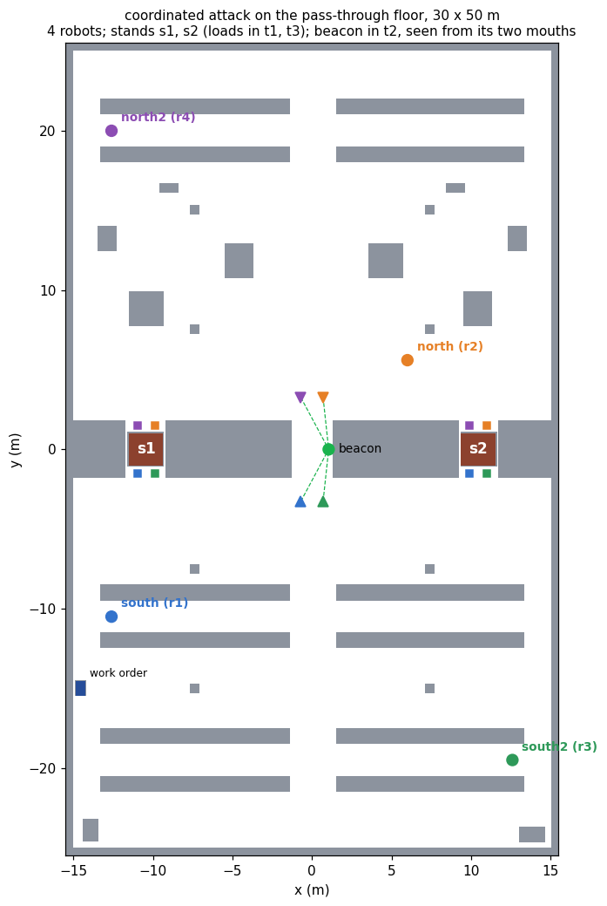

# coordinated_attack_demo

Common knowledge as a precondition, on the floor the robots drive.

Two robots must lift one load together, one under each end. A work order names
which of two stands the load is on, and only one of the robots can read it. An
end raised alone tips the load off the stand, and a robot that waits does no
harm, so a robot raises its end only if it knows the other raises the other,
and the other raises only under the same condition. The weakest condition that
satisfies both is common knowledge of where the lift is (Halpern and Moses,
1990), and it is the precondition of `lift`.

Two means of communication are available. A radio reaches either robot from
anywhere and can lose a message without anyone knowing that it did. A beacon,
a stack light in the one open bay of the racking block, is seen only from that
bay's two mouths. The planner is asked which of the two can establish the
precondition, and the robots then do what it answers, in Gazebo.

```
ros2 launch coordinated_attack_demo coordinated_attack_launch.py                # beacon floor
ros2 launch coordinated_attack_demo coordinated_attack_launch.py floor:=radio   # no beacon
ros2 launch coordinated_attack_demo coordinated_attack_launch.py order:=s2      # the other leaf
ros2 launch coordinated_attack_demo coordinated_attack_launch.py floor:=sight   # positions unannounced
ros2 launch coordinated_attack_demo coordinated_attack_launch.py floor:=blind   # and crates across t2
ros2 launch coordinated_attack_demo coordinated_attack_launch.py robots:=4 messages:=2               # four robots
ros2 launch coordinated_attack_demo coordinated_attack_launch.py robots:=4 messages:=2 floor:=radio
bash tools/validate.sh                                                          # thirteen checks, no simulator
python3 tools/scaling.py --out /tmp/ca_scaling                                  # the scaling tables
python3 tools/ladder.py --table 2,3,4,5 --depths 1,2,3,4,5 --out /tmp/ca_ladder # messages per level
bash tools/record_demo.sh radio  s1 /tmp/raw_radio.mkv  /tmp/run_radio.log      # Xvfb recording
bash tools/record_demo.sh beacon s1 /tmp/raw_beacon.mkv /tmp/run_beacon.log
ROBOTS=4 MESSAGES=2 bash tools/record_demo.sh beacon s1 /tmp/raw_n4.mkv /tmp/run_n4.log
```

## The floor

The floor is `pass_through_demo`'s: a racking block crosses a 30 by 50 metre
hall from wall to wall, and three pass-through bays, `t1`, `t2` and `t3`, are
the only gaps in it. `tools/layout.py` imports that floor and does not restate
it. What changes is what the bays are for.

<p align="center">
  <br>
  <sub><b>Figure 1.</b> The floor plan both robots hold. The loads in <code>t1</code> and
  <code>t3</code> are the stands <code>s1</code> and <code>s2</code>; the squares beside
  them are where each robot stands under its end. The beacon is in <code>t2</code>, and
  the dashed lines are the sight lines from its two viewpoints. south starts on the
  storage floor and reads the order at the terminal on the west wall; north starts on
  the dispatch floor.</sub>
</p>

Everything on the plan is common knowledge, loads and beacon included. The
uncertainty is in the work order, which is not a fact about the floor.

The domain makes four claims about this geometry, and
`tools/make_floorplan.py` checks each on the plan, by casting rays over the
occupied cells, before it writes anything:

| claim | why the domain needs it |
| --- | --- |
| from where they start, neither robot sees the other or the beacon | otherwise the radio would not be the only channel |
| from its viewpoint, each robot sees the beacon | the observability condition of `signal` |
| under the two ends of one load, the robots do not see each other | otherwise meeting at the stand would replace the beacon |
| every place a robot is sent is reachable over the inflated plan | otherwise a policy could be correct and undrivable |

The third matters most. A robot under one end of a load is 3 m from the other
robot and cannot see it, because the load is between them. Meeting at the
stand gives no more common knowledge than the start did.

## The problem

Agents `south` and `north`, stands `s1` and `s2`. The initial model has two
worlds, both designated, with `job(s1)` in one and `job(s2)` in the other. Both
relations are total, and `reads-order(south)` is common knowledge.

| action | type | events | observers |
| --- | --- | --- | --- |
| `read-order(i, s)` | semi-private sensing | `job(s)`, `¬job(s)` | `i` fully, the other partially |
| `tell`, `ack`, `ack2`, `ack3` `(i, j, s)` | lossy message | delivered, lost, never sent | sender, receiver |
| `go-view(i)` | public ontic | `at-view(i)` | everyone |
| `signal(i, s)` | announcement of `K_i job(s)` | signal, nothing | a robot at a viewpoint fully, any other obliviously |
| `lift(s)` | public ontic | pre `job(s) ∧ C_{south,north} job(s)` | everyone |

The goal is `lifted`. Its epistemic content is the precondition of `lift`.

`read-order` also requires `¬at-view(i)`: the order is read at the terminal,
which is not a viewpoint, so it is read before the reader goes to its
viewpoint. A sensing event carries no effects in the action-type library, so
the domain cannot say that reading takes the robot away from the viewpoint, and
says this instead. Without it the planner sent south to its viewpoint first,
and the first run drove it back to the terminal and had it signal from there.
The signal performer's line-of-sight check caught it: `south no, north yes`.

### A message that can be lost

The intermediate library has no lossy message, so `epddl/lossy.epddl` defines
one. It has three events: the message delivered, the same message sent and
lost, and nothing sent at all.

| relation | pairs |
| --- | --- |
| sender | delivered ~ lost; never sent apart |
| receiver | lost ~ never sent; delivered apart |

The sender knows it sent and cannot tell whether the message arrived. The
receiver knows whether something arrived, and when nothing did it cannot tell
a loss from silence. Both relations are equivalences, so the model stays S5.

Only delivery is designated, so in every run the message arrives. Delivery
that happens without anyone knowing it happened is the whole argument, and a
run in which messages were lost would be a weaker demonstration of it.

The four messages are one level deeper each. `tell` is south saying where the
load is, with precondition `K_south job(s)`; `ack` is north saying it heard,
with precondition `K_north K_south job(s)`; and so on to depth four. Each goes
out at most once, which a log on the sender's side enforces.

Without that bound a message can be repeated, and each repetition leaves a
model that no earlier one is bisimilar to, so the space is infinite. In an
earlier version of the domain without the log the planner searched to depth 8
in 240 s and could not exhaust it. With the bound the space is finite, and an
exhausted search proves that no policy exists for this four-message protocol.

That no longer exchange succeeds either is proved over the event model, in
the report on the project pages (Proposition 2 and its corollary). Take a
shortest path from the designated world to a counterexample. Two steps of the
product, through the lost copy and into the copy in which nothing was sent,
reach the second world of that path, and the rest of the path is copied
unchanged. So a message adds at most one level of mutual knowledge, whether or
not it is delivered, and no finite sequence of messages reaches C. The four
delivered messages of the run attain that bound exactly.

Two traps were found on the way. plank keys an event model by event name, so
passing one event as both "delivered" and "lost" makes them a single event,
and the loss disappears from the model. The first radio result, unsolvable at
depth 3, came from that, and each message now has a lost event of its own.
And a group modality over a static atom needs `:static-common-knowledge`, not
`:common-knowledge`.

## What the planner returns

plank grounds each floor into 12 atoms and 28 ground actions. On the beacon
floor Aletheia returns a policy of depth 5 with two leaves after 115 AO\*
expansions:

```
go-view(north)
read-order(south, s1)
  e-here      → go-view(south) → signal(south, s1) → lift(s1)
  e-elsewhere → go-view(south) → signal(south, s2) → lift(s2)
```

The policy does not use the radio. Before the branch both leaves prescribe the
same actions, and after it the branch is announced on the beacon, so neither
robot needs to know the branch to execute its part.

On the radio floor, which differs from the beacon floor in one line of the
problem file, the planner exhausts its space at depth 5 and returns no policy.

## The ladder

`tools/trace.py` applies the protocol by hand and, after each action, computes
the depth of mutual knowledge: the largest k with `E^k job(s1)`, where `E` is
"both robots know". A breadth-first walk over the union of the two relations
from the designated worlds finds the nearest world where `job(s1)` fails; if it
is L steps away, `E^(L-1)` holds and `E^L` does not. The walk is printed, and
it is the chain that blocks common knowledge.

```
read-order(south, s1)   K_south yes  K_north no    E^0   north considers ¬job
tell(south, north)      4 worlds                   E^1   south considers north considers ¬job
ack(north, south)       6 worlds                   E^2
ack2(south, north)      8 worlds                   E^3
ack3(north, south)      10 worlds                  E^4
lift(s1)                not applicable
```

Every delivered message adds one level, and two worlds: one in which that
message was lost, and one in which it was never sent. After the fourth, the
chain reads world by world

```
tell, ack, ack2, ack3 delivered        (actual)
  north considers   ack3 lost
  south considers   ack2 lost
  north considers   ack lost
  south considers   tell lost
  north considers   the load on s2
```

Each step of the chain undoes one message, and a fifth message would only add
one more step at the front. On the beacon floor one `signal`, with both robots
at their viewpoints, takes the depth from `E^0` to C. Lit with only south at a
viewpoint, north is oblivious to it, the depth stays at `E^0`, and `lift` does
not apply: the announcement yields common knowledge only because each robot's
view of the beacon is itself common knowledge.

`tools/validate.sh` checks all four of these without a simulator, and fails
unless the beacon floor has a policy whose every leaf lifts under C, the radio
floor has none, the ladder climbs E^1 to E^4 without C, and the lone signal
leaves `lift` inapplicable.

## On the floor

Every epistemic action is performed by a node that does something a robot or
the warehouse would do, and the model is advanced by ePlanSys's epistemic state
after each one, with Aletheia's own product update.

| action | performer | what it does |
| --- | --- | --- |
| `read-order` | `read_order_action` | south drives to the terminal and reads the order, which the node is given as the warehouse's record: `order:=s1` |
| radio | `radio_action`, one per level | puts the message on the receiver's inbox and waits for it to arrive, the system's check that the designated event is the one that happened; nothing reports it to the sender |
| `go-view` | `go_view_action`, one per robot | drives to the mouth of `t2`, and checks the beacon is in line of sight from where the robot stopped |
| `signal` | `signal_action` | lights the beacon's tier for the stand, after checking that every robot the model places at a viewpoint has the beacon in line of sight, and refusing if one does not; as `signal_to`, in the positions domain, it also reports which event occurred, `e-signal-seen` when the listener has the beacon in line of sight from where it stands |
| `sight` | `sight_action` | positions domain only: reads each robot's laser along the bearing to the other, and refuses unless both beams reach the other robot |
| `lift` | `lift_action` | drives both robots to their mouths of the stand, fixes one start for both, drives each in under its end, then raises the load |

Routes are `pass_through_demo`'s least fixed point over the floor plan, through
its exported driver. The stack light has one tier per stand, lower for `s1` and
upper for `s2`, because what the beacon announces is which stand. The lift is
drawn by moving the load through `gazebo_ros_state`: the Waffles have no lift,
and the frame shows the load coming up only after both robots are under it.

The executor checks every action's knowledge requirement against the model
before it dispatches it. For `lift` that requirement is
`(C (south north) job_s1)`, evaluated by the epistemic state. On the radio floor
there is no policy to run, so the mission runs the protocol as a policy written
out by hand, with each action's requirement written as the planner writes it,
and reports the floor as complete only if the executor refused `lift` with
`K_north K_south K_north K_south job(s1)` holding and `C job(s1)` not.

## The recorded runs

Both floors were recorded on a 3840 × 1080 Xvfb display, RViz on the left
half and Gazebo on the right, with `order:=s1`, and composed into one film:
an opening card, the radio floor, the beacon floor, and a closing card whose
figures are the runs'. Every figure
below is a line the runs wrote.

**Radio floor.** The planner exhausted its space at depth 5 and the mission
ran the protocol:

```
no policy for lifted, after 0.2 s           Search space exhausted at depth 5
read-order(south, s1)   the order names s1 -> e-here           2 worlds   E^0
tell(south, north, s1)  "K_south job(s1)" delivered            4 worlds   E^1
ack(north, south, s1)   "K_north K_south job(s1)" delivered    6 worlds   E^2
ack2(south, north, s1)  delivered                              8 worlds   E^3
ack3(north, south, s1)  delivered                             10 worlds   E^4
lift(s1)                knowledge requirement does not hold: (C (south north) job_s1)
```

The chains knowledge_view computed from the live model after each message
(`south>north`, `north>south>north`, and so on to five steps after the
fourth) are the ones `tools/trace.py` computes offline. Neither robot moved
toward a stand.

**Beacon floor.** The planner returned the policy above, 8 items with
`go-view(south)` written once per branch, in 0.2 s:

```
go-view(north)          at its viewpoint after 17 s; beacon in line of sight, 3.5 m
read-order(south, s1)   at the terminal after 12 s; the order names s1 -> e-here      E^0
go-view(south)          at its viewpoint after 47 s; beacon in line of sight, 3.5 m
signal(south, s1)       in line of sight of it: south yes (3.5 m), north yes (3.5 m)  C
lift(s1)                both at their mouths after 22 and 23 s; one start for both
                        under the load after 13.5 and 13.1 s: starts 0.00 s apart,
                        arrivals 0.40 s apart; load_s1 raised 0.12 m, 44 s after lift began
```

The other branch, `order:=s2`, was run headless: the order read as
`e-elsewhere`, the `s2` tier lit, C held, and `load_s2` came up with the
arrivals 0.60 s apart.

The first run of the beacon floor, before `read-order` required
`¬at-view(i)`, went the other way. The policy sent south to its viewpoint,
then to the terminal, and had it signal from the terminal. The model counted
south at its viewpoint, and the line-of-sight check read `south no, north
yes`. The signal performer now refuses to signal when the model and the floor
disagree about who sees the beacon.

After `mission complete`, the performers exit with signal 11 when the launch
shuts down. This happens after the result is logged and has not been traced.

## When positions are not announced

`epddl/coordinated-attack-positions.epddl` takes away the assumption the
beacon floor rests on. A move to a viewpoint is witnessed only by the robot
that makes it: the other relates it to the robot not having moved, so it does
not know where the mover stands, and believes nothing false about it either
(`unwitnessed-move` in `epddl/moves.epddl`). Two instances differ in one line:
whether the two viewpoints see each other through `t2`, which the floor check
already establishes.

### Who saw the beacon

The first version of the signal kept its conditional audience, a robot at a
viewpoint observing it fully and any other obliviously, and the planner found
a policy on the floor where the robots never see each other. The trace,
which then evaluated each robot's observability condition at every world,
said the lift should be refused there.

The two disagreed about the semantics. plank's own product update, and
Aletheia's after it, fix each agent's observability type once per state: the
type whose condition holds at the designated worlds applies at every world.
Whether a listener saw an announcement is therefore common knowledge by
construction, whatever the listener's position is to the others. On the
published floors the two readings agree, since the move to a viewpoint is
public there, and the models exported for the pages are identical under
both. Here they do not.

So the domain says it in the event model. The signal is an
`unconfirmed-announcement`: the tier lit where the listener can see it, the
same tier lit where it cannot, and nothing. The announcer relates the first
two and the listener the last two, which is the lossy message again, and
which of the first two occurs is decided by where the listener stands. When
the listener's position is common knowledge, the second has no world to
occur in, and the signal is a public announcement. `trace.py` now uses the
tools' semantics, and `--per-world` the other.

The sighting is an announcement that both robots stand at their viewpoints,
observed by whoever stands at one. In the actual world both do, so it is
public, and their positions become common knowledge.

### What the planner returns

| instance | result |
| --- | --- |
| viewpoints see each other | policy of depth 6, two leaves, 298 expansions |
| viewpoints do not | no policy: space exhausted at depth 8 |

```
go-view(north)
read-order(south, s1)
  e-here      → go-view(south) → sight → signal(south, north, s1) → lift(s1)
  e-elsewhere → go-view(south) → sight → signal(south, north, s2) → lift(s2)
```

The trace gives the reason for the sighting:

| after | depth of job(s1) |
| --- | --- |
| the signal, with no sighting | `E^1`, and lift not applicable |
| the sighting, then the signal | `C` |
| the signal, then the sighting | `C` |

Without the sighting the beacon is worth one radio message: north sees it, and
south cannot tell that north did, because south considers possible that north
never left its start. With the sighting first, the signal is public. And a
sighting after the signal makes the signal common knowledge after the fact: in
every world where both robots stood at their viewpoints, the signal was seen.
Neither the beacon nor the radio can make the positions common knowledge, so
on the floor without the sight line there is no policy at all.

### On the floor

`floor:=sight` runs the sight instance on the beacon floor. `floor:=blind`
runs the blind one on the same floor with a stack of crates on the axis of
`t2`, which `make_floorplan.py` checks leaves the beacon in sight from each
viewpoint and hides the viewpoints from each other. The sighting is
`sight_action`: along the bearing from each robot to the other, the robot's
own laser must read nothing short of the other robot. On the blind floor
there is no policy, and the mission runs the sight floor's policy without the
sighting, as the radio floor runs its protocol.

```
                         sight floor                       blind floor
go-view(north)           4 worlds, 2 designated            4 / 2
read-order(south, s1)    e-here                 4 / 1 E^0  e-here        4 / 1 E^0
go-view(south)                                  8 / 1 E^0                8 / 1 E^0
sight(north, south)      6.6 m apart, lasers read 6.7 m: clear
                         both positions known  10 / 1 E^0  (no sight line)
signal(south, north, s1) e-signal-seen         13 / 1 C    e-signal-seen 10 / 1 E^1
lift(s1)                 starts 0.00 s apart, arrivals     refused: (C (south north) job_s1)
                         0.40 s apart; raised 0.12 m
```

Until the sighting neither robot knows where the other stands, and RViz
says so beside each viewpoint. On the blind floor the signal tells north the
stand and also where south stands, since it is made only from a viewpoint;
south learns nothing about north, and the chain that blocks `C` is south, then
north. The mission confirms `K_north job(s1)` and not
`K_south K_north job(s1)` before it reports the refusal as the expected
outcome.

## More robots, and more message levels

`tools/scaled.py` writes the domain for any number of robots and any number
of message levels, and the launch file runs it with `robots:=` and
`messages:=`. Two things are made general.

Every robot takes a share of the load, so `lift` requires `C_All job(s)`,
common knowledge over all of them. The robots are `south`, `north`, `south2`,
`north2`, and so on, alternately on the storage and the dispatch floor, and
south reads the order.

A radio message at level l, from i to j, says `K_i E^(l-1) job(s)`: the
sender knows that everyone knows, l-1 times over, which stand the order
names. Level 1 is `tell`, level 2 `ack`, level 3 `ack2`, and each level goes
from each sender to each receiver at most once. With two robots this is the
published content: `E` is then `K_south` and `K_north` together, and
`K_i E^(l-1) job(s)` is equivalent in S5 to `K_i K_j K_i ... job(s)`, l
operators deep. What differs is the log, which the published domain keeps per
level and this one per level and pair, so that at n = 2 it admits each
message and its mirror image.

With more than two robots a message has bystanders, which neither send nor
receive it. `epddl/lossy.epddl` gives them a type of their own, `Bystander`,
which relates all three events: a robot that does not hear the radio cannot
tell a delivery from a loss or from silence. `Oblivious` would not do. It
maps every event onto the one in which nothing was sent, and since the other
two write the sender's log, an oblivious bystander would come to believe that
no message went out when one did, and the frame would leave S5. The
published floors never name the type, and their grounded tasks are unchanged
apart from the added relation.

### The beacon floor

Measured by `tools/scaling.py`: plank's grounding, then Aletheia at one
thread, once with AO\* and once replanning over the all-outcomes
determinization, each with the whole 300 s. A cell is the result, the
expansions and the time; four message levels throughout, since the beacon
floor never uses them and its cost hardly moves with them.

| robots | atoms | actions | AO\* | replanning | traced |
| ---: | ---: | ---: | --- | --- | --- |
| 2 | 24 | 28 | depth 5, 137, 0.0 s | depth 5, 8, 0.0 s | C at both leaves |
| 3 | 46 | 65 | depth 6, 868, 0.2 s | depth 6, 11, 0.0 s | C at both leaves |
| 4 | 76 | 118 | depth 7, 8 038, 4.6 s | depth 7, 14, 0.0 s | C at both leaves |
| 5 | 114 | 187 | depth 8, 108 298, 112.3 s | depth 8, 17, 0.0 s | C at both leaves |
| 6 | 160 | 272 | cut off at depth 8, 165 772 | depth 9, 20, 0.1 s | C at both leaves |
| 7 | 214 | 373 | cut off at depth 7, 99 175 | depth 10, 23, 0.1 s | C at both leaves |
| 8 | 276 | 490 | cut off at depth 7, 84 110 | depth 11, 26, 0.2 s | C at both leaves |
| 9 | 346 | 623 | cut off at depth 7, 78 032 | depth 12, 29, 0.4 s | C at both leaves |
| 10 | 424 | 772 | cut off at depth 7, 68 467 | depth 13, 32, 0.7 s | C at both leaves |

The policy is the published one with a viewpoint for every robot: each robot
but the reader goes to its viewpoint, the order is read, the reader goes to
its viewpoint and signals, and the robots lift. Its depth is n + 3, and one
signal yields C over all n robots, whatever n is, because each stands where
the beacon is seen and that each does is common knowledge. `trace.py`
replays every policy found and reports the goal at both leaves, so every lift
in it is made under C over all n.

AO\* pays about a factor of ten for each robot and does not finish at six.
Replanning finds the same policy in 3n + 2 expansions, ten robots in under a
second.

### The radio floor

| robots | levels | atoms | actions | AO\* | replanning |
| ---: | ---: | ---: | ---: | --- | --- |
| 2 | 1 | 12 | 16 | exhausted at depth 3, 14, 0.0 s | refuted, 5, 0.0 s |
| 2 | 2 | 16 | 20 | exhausted at depth 5, 52, 0.0 s | refuted, 15, 0.0 s |
| 2 | 3 | 20 | 24 | exhausted at depth 7, 282, 0.1 s | refuted, 81, 0.0 s |
| 2 | 4 | 24 | 28 | exhausted at depth 9, 2 224, 1.7 s | refuted, 563, 0.8 s |
| 2 | 5 | 28 | 32 | exhausted at depth 11, 18 990, 45.9 s | refuted, 3 989, 18.4 s |
| 2 | 6 | 32 | 36 | cut off at depth 12, 89 529 | timeout, 16 350 |
| 3 | 1 | 19 | 29 | exhausted at depth 7, 294, 0.1 s | refuted, 67, 0.1 s |
| 3 | 2 | 28 | 41 | cut off at depth 10, 36 517 | timeout, 353 |
| 3 | 3 | 37 | 53 | cut off at depth 10, 74 958 | timeout, 26 |
| 4 | 1 | 28 | 46 | cut off at depth 9, 20 500 | timeout, 435 |
| 4 | 2 | 44 | 70 | cut off at depth 9, 48 601 | timeout, 17 |
| 5 | 1 | 39 | 67 | cut off at depth 8, 37 629 | timeout, 15 |

There is no policy to find here, and what is measured is the price of
proving it. AO\* proves it by exhausting the space. Replanning proves it by
refuting the determinization, which is sound for unsolvability, since a
policy of the task would be one of its determinization. At two robots both
proofs finish up to five levels, and each level costs AO\* about a factor of
eight. A third robot leaves one level within reach, and four robots none.
The space is every order in which up to n(n-1)m messages can go out, and it
outgrows the search long before the robots fill the floor.

Where a search ran out of budget, nothing is claimed for that floor from the
search. That none of these floors has a policy is the corollary of the
report: a message adds at most one level of mutual knowledge, whether or not
it is delivered. The report proves it for two robots, by a path through the
sender's and the receiver's relations; a bystander relates all three events,
which only adds edges to the product and cannot lengthen that path, so the
bound holds with any number of robots.

Aletheia (at 314bc29) prints a search's expansions only when it finds a
policy. The counts for searches that ended without one were taken with a
build that also prints them there and changes nothing else; on the four
published floors it returns the installed planner's results, expansion for
expansion. Replanning runs past its deadline on the larger floors, in a step
that does not check the clock: by 40 % in the table, and in one earlier run to
more than twice it before it was stopped. `scaling.py` kills a run at one and
a half times its budget. The machine was running other searches alongside, so
read the expansions, and the seconds as orders of magnitude.

### What each level costs

`tools/ladder.py` gives the planner the radio floor with the goal E^k job(s)
in place of `lifted`. AO\* deepens one action at a time, so the first policy
it finds has the fewest messages that reach E^k, among the messages of this
domain. `trace.py`'s product update then replays it, and has to agree on the
depth after every message, and that at the end C does not hold and `lift`
does not apply.

| robots | E^1 | E^2 | E^3 | E^4 | E^5 |
| ---: | ---: | ---: | ---: | ---: | ---: |
| 2 | 1 | 2 | 3 | 4 | 5 |
| 3 | 2 | 4 | 6 | 8 | ≥ 10 |
| 4 | 3 | 6 | ≥ 9 | | |
| 5 | 4 | ≥ 8 | | | |

A cell marked ≥ ran out of its budget, 600 s, or an hour for four robots and
E^3. The deadline is checked between iterations, so every depth before the
one it cut off was searched in full without a policy, and that bounds the
count from below. In every cell, E^k costs k(n-1) messages where the search
finished, and at least that where it did not.

That is fewer than the levels suggest. A robot that knows where the load is
can only have learnt it from one that knew first, so a message says more than
its content: when north tells south2 `K_north job(s)`, south2 also learns that
south knew, since north could have heard it from no one else. The protocols
the planner finds use this. With three robots they relay along a line, south,
north, south2 and back. With four, E^2 is a relay out to north2 and a
broadcast back from it, and this is the protocol the mission runs on the
four-robot radio floor:

```
read-order(south, s1)                 E^0
tell(south, north)        4 worlds    E^0
tell(north, south2)       6 worlds    E^0
tell(south2, north2)      8 worlds    E^1
ack(north2, north)       10 worlds    E^1
ack(north2, south2)      16 worlds    E^1
ack(north2, south)       34 worlds    E^2
lift(s1)                 not applicable
```

The first version of `ladder.py` counted only the highest level each robot
had heard from each other, and searched over that. The product update
refuted the count on its first random sequences: after `tell(south, north)`,
`tell(north, south)` and `ack(south, north)` the depth is E^3, where the count
said E^2. The search is the planner's for that reason.

### Four robots on the floor

<p align="center">
  <br>
  <sub><b>Figure 2.</b> The floor plan with four robots. south2 starts at the east
  end of the storage floor's southern aisle and north2 at the west end of the
  dispatch floor's aisle. Two robots on one side stand abreast at t2, and under
  a load each takes one corner of its end.</sub>
</p>

The floor plan does not change. `make_floorplan.py --robots 4` checks the four
claims for every robot and every pair: no robot starts in sight of another or
of the beacon, each viewpoint sees the beacon, no robot under one end of a
load sees one under the other, and every place a robot is sent is reachable.
Two robots at one end see each other, which is the same side; C over all four
still needs the robots across the load.

Both four-robot floors were recorded as the published ones were, with
`order:=s1` and two message levels. **Beacon floor.** ePlanSys's AO\*
returned the policy, 10 items and two leaves, in 4.2 s:

```
go-view(north)          at its viewpoint after 17 s; beacon in line of sight, 3.3 m
go-view(south2)         at its viewpoint after 60 s; 3.4 m
go-view(north2)         at its viewpoint after 62 s; 3.9 m
read-order(south, s1)   at the terminal after 17 s; the order names s1 -> e-here        E^0
go-view(south)          at its viewpoint after 53 s; 3.8 m
signal(south, s1)       in line of sight of it: all four, 3.3 to 3.8 m                 C
lift(s1)                all four at their mouths after 26 to 28 s; one start for all
                        under the load after 13.7 and 13.8 s: starts 0.00 s apart,
                        arrivals 0.10 s apart; load_s1 raised 0.12 m, 50 s after lift began
```

The other branch, `order:=s2`, was run headless: the order read as
`e-elsewhere`, the `s2` tier lit, C held over all four, and `load_s2` came up
with the arrivals 0.70 s apart.

**Radio floor.** The planner searched its 120 s and was cut off at depth 8
with no policy, which on this floor is its budget and not a proof. The mission ran
the protocol above, and the knowledge view's depths after each message were
the ones `ladder.py` computes offline: E^0, E^0, E^1, E^1, E^1, E^2, with 34
worlds after the sixth. The executor refused `lift(s1)` with E^2 job(s1)
holding among the four robots and C job(s1) not.


The first four-robot runs left two robots short of the load. Having turned on
the spot to face into the bay, a simulated Waffle driven straight drifts back
towards the heading it arrived on, about forty degrees over the metre and a
half into the bay, with no turn in any command it is sent; the outer two ran
into the side of the bay, and the inner two drifted as far and counted as
under only because depth into the bay was all that was measured. `lift` now
creeps along the line from each robot's mouth and steers back onto it
(`creep(speed, x0, y0, heading)` in pass_through_demo's driver), and the four
arrive together. The published two-robot runs used the open-loop creep on
the axis of the bay, where a drift of that size still ends inside it; whether
they drifted was not measured.

The mission's planner client also waited 15 s for an answer, its default,
while the planner searched for 120. On the published floors the planner
answers in under a second; on the four-robot radio floor it searches its whole
budget, and the client is now given that budget and a margin.

## What this does not show

* That the search alone shows the general result. The planner proves it for
  four messages, one per level; the unbounded statement is the corollary of
  the report, proved over the event model and not searched.
* A lost message. Only delivery is designated, and every message in the runs
  arrived. The point is that it does not matter.
* On the beacon and radio floors, that the robots' positions are common
  knowledge for a reason the robots can see: `go-view` is public there, on the
  argument that each robot runs the same policy. The positions domain removes
  that argument, and on its floors the reason is a sighting each robot makes
  with its own laser.
* A physical lift. The load is moved by the simulator once both robots are
  under it.
* With more robots or levels, that the search settles the radio floor. It
  does for two robots up to five levels and for three robots at one; beyond
  that the searches ran out of budget, and the floor is settled by the
  argument given there and not by the planner.
* That E^k costs k(n-1) messages in general. Each count in the table is
  proved minimal for its cell by iterative deepening, within this family of
  messages; the formula is a pattern over the cells.
* The positions domain with more than two robots. The sighting and the
  unconfirmed announcement are written for a pair, and the sight and blind
  floors run with two.
* More than four robots in Gazebo. The floor has places for four; the
  planner's tables go to ten.

## Files

| file | contents |
| --- | --- |
| `epddl/coordinated-attack.epddl` | the domain |
| `epddl/lossy.epddl` | the lossy message action type, with the bystander type more than two robots need |
| `epddl/beacon.epddl`, `epddl/radio.epddl` | the two floors, one line apart |
| `epddl/coordinated-attack-positions.epddl` | the domain with moves only the mover witnesses |
| `epddl/moves.epddl` | the unwitnessed move and the unconfirmed announcement |
| `epddl/positions-sight.epddl`, `epddl/positions-blind.epddl` | with and without the sight line, one line apart |
| `tools/layout.py` | the floor, on pass_through_demo's, with places for four robots |
| `tools/make_floorplan.py` | the three floor plans, the four geometric claims for two to four robots, and the blind floor's two |
| `tools/make_world.py` | the Gazebo world and the lamp models |
| `tools/trace.py` | product update with conditional observability, bisimulation contraction, and the depth of `E^k` |
| `tools/validate.sh` | grounds, solves and traces; thirteen checks, four per published domain and five for the scaled one |
| `tools/scaled.py` | the domain and both floors for n robots and m message levels, with the action mapping and the classical model the launch runs them with |
| `tools/scaling.py` | grounds and solves the scaled floors, and writes the two tables of the section on scale |
| `tools/ladder.py` | the fewest messages that reach E^k, found by the planner and replayed by the product update; `--replay` checks a protocol file |
| `protocols/radio-n4-m2.json` | the four-robot radio protocol the mission runs |
| `docs/floorplan_n4.png` | the floor plan with four robots |
| `tools/record_demo.sh` | one floor on an Xvfb display, RViz left and Gazebo right |
