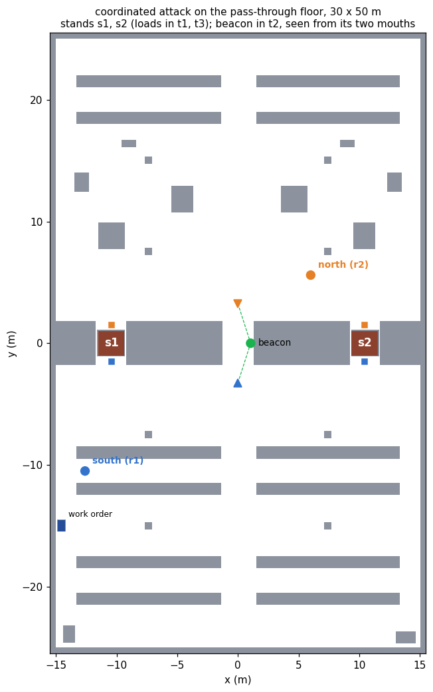

# coordinated_attack_demo

Common knowledge as a precondition, on the floor the robots drive.

Two robots must lift one load together, one under each end. A work order names
which of two stands the load is on, and only one of the robots can read it. An
end raised alone tips the load off the stand, and a robot that waits does no
harm, so a robot raises its end only if it knows the other raises the other,
and the other raises only under the same condition. The weakest condition that
satisfies both is common knowledge of where the lift is (Halpern and Moses,
1990), and it is the precondition of `lift`.

Two means of communication are available. A radio reaches either robot from
anywhere and can lose a message without anyone knowing that it did. A beacon,
a stack light in the one open bay of the racking block, is seen only from that
bay's two mouths. The planner is asked which of the two can establish the
precondition, and the robots then do what it answers, in Gazebo.

```
ros2 launch coordinated_attack_demo coordinated_attack_launch.py                # beacon floor
ros2 launch coordinated_attack_demo coordinated_attack_launch.py floor:=radio   # no beacon
ros2 launch coordinated_attack_demo coordinated_attack_launch.py order:=s2      # the other leaf
bash tools/validate.sh                                                          # eight checks, no simulator
bash tools/record_demo.sh radio  s1 /tmp/raw_radio.mkv  /tmp/run_radio.log      # Xvfb recording
bash tools/record_demo.sh beacon s1 /tmp/raw_beacon.mkv /tmp/run_beacon.log
python3 tools/make_video.py --radio  /tmp/raw_radio.mkv  /tmp/run_radio.log  /tmp/raw_radio_policy.json \
                            --beacon /tmp/raw_beacon.mkv /tmp/run_beacon.log /tmp/raw_beacon_policy.json \
                            --out /tmp/coordinated_attack.mp4
```

## The floor

The floor is `pass_through_demo`'s: a racking block crosses a 30 by 50 metre
hall from wall to wall, and three pass-through bays, `t1`, `t2` and `t3`, are
the only gaps in it. `tools/layout.py` imports that floor and does not restate
it. What changes is what the bays are for.

<p align="center">
  <br>
  <sub><b>Figure 1.</b> The floor plan both robots hold. The loads in <code>t1</code> and
  <code>t3</code> are the stands <code>s1</code> and <code>s2</code>; the squares beside
  them are where each robot stands under its end. The beacon is in <code>t2</code>, and
  the dashed lines are the sight lines from its two viewpoints. south starts on the
  storage floor and reads the order at the terminal on the west wall; north starts on
  the dispatch floor.</sub>
</p>

Everything on the plan is common knowledge, loads and beacon included. The
uncertainty is in the work order, which is not a fact about the floor.

The domain makes four claims about this geometry, and
`tools/make_floorplan.py` checks each on the plan, by casting rays over the
occupied cells, before it writes anything:

| claim | why the domain needs it |
| --- | --- |
| from where they start, neither robot sees the other or the beacon | otherwise the radio would not be the only channel |
| from its viewpoint, each robot sees the beacon | the observability condition of `signal` |
| under the two ends of one load, the robots do not see each other | otherwise meeting at the stand would replace the beacon |
| every place a robot is sent is reachable over the inflated plan | otherwise a policy could be correct and undrivable |

The third matters most. A robot under one end of a load is 3 m from the other
robot and cannot see it, because the load is between them. Meeting at the
stand gives no more common knowledge than the start did.

## The problem

Agents `south` and `north`, stands `s1` and `s2`. The initial model has two
worlds, both designated, with `job(s1)` in one and `job(s2)` in the other. Both
relations are total, and `reads-order(south)` is common knowledge.

| action | type | events | observers |
| --- | --- | --- | --- |
| `read-order(i, s)` | semi-private sensing | `job(s)`, `¬job(s)` | `i` fully, the other partially |
| `tell`, `ack`, `ack2`, `ack3` `(i, j, s)` | lossy message | delivered, lost, never sent | sender, receiver |
| `go-view(i)` | public ontic | `at-view(i)` | everyone |
| `signal(i, s)` | announcement of `K_i job(s)` | signal, nothing | a robot at a viewpoint fully, any other obliviously |
| `lift(s)` | public ontic | pre `job(s) ∧ C_{south,north} job(s)` | everyone |

The goal is `lifted`. Its epistemic content is the precondition of `lift`.

`read-order` also requires `¬at-view(i)`: the order is read at the terminal,
which is not a viewpoint, so it is read before the reader goes to its
viewpoint. A sensing event carries no effects in the action-type library, so
the domain cannot say that reading takes the robot away from the viewpoint, and
says this instead. Without it the planner sent south to its viewpoint first,
and the first run drove it back to the terminal and had it signal from there.
The signal performer's line-of-sight check caught it: `south no, north yes`.

### A message that can be lost

The intermediate library has no lossy message, so `epddl/lossy.epddl` defines
one. It has three events: the message delivered, the same message sent and
lost, and nothing sent at all.

| relation | pairs |
| --- | --- |
| sender | delivered ~ lost; never sent apart |
| receiver | lost ~ never sent; delivered apart |

The sender knows it sent and cannot tell whether the message arrived. The
receiver knows whether something arrived, and when nothing did it cannot tell
a loss from silence. Both relations are equivalences, so the model stays S5.

Only delivery is designated, so in every run the message arrives. Delivery
that happens without anyone knowing it happened is the whole argument, and a
run in which messages were lost would be a weaker demonstration of it.

The four messages are one level deeper each. `tell` is south saying where the
load is, with precondition `K_south job(s)`; `ack` is north saying it heard,
with precondition `K_north K_south job(s)`; and so on to depth four. Each goes
out at most once, which a log on the sender's side enforces.

Without that bound a message can be repeated, and each repetition leaves a
model that no earlier one is bisimilar to, so the space is infinite. In an
earlier version of the domain without the log the planner searched to depth 8
in 240 s and could not exhaust it. With the bound the space is finite, and an
exhausted search proves that no policy exists for this four-message protocol.

That no longer exchange succeeds either is proved over the event model, in
the report on the project pages (Proposition 2 and its corollary). Take a
shortest path from the designated world to a counterexample. Two steps of the
product, through the lost copy and into the copy in which nothing was sent,
reach the second world of that path, and the rest of the path is copied
unchanged. So a message adds at most one level of mutual knowledge, whether or
not it is delivered, and no finite sequence of messages reaches C. The four
delivered messages of the run attain that bound exactly.

Two traps were found on the way. plank keys an event model by event name, so
passing one event as both "delivered" and "lost" makes them a single event,
and the loss disappears from the model. The first radio result, unsolvable at
depth 3, came from that, and each message now has a lost event of its own.
And a group modality over a static atom needs `:static-common-knowledge`, not
`:common-knowledge`.

## What the planner returns

plank grounds each floor into 12 atoms and 28 ground actions. On the beacon
floor Aletheia returns a policy of depth 5 with two leaves after 115 AO\*
expansions:

```
go-view(north)
read-order(south, s1)
  e-here      → go-view(south) → signal(south, s1) → lift(s1)
  e-elsewhere → go-view(south) → signal(south, s2) → lift(s2)
```

The policy does not use the radio. Before the branch both leaves prescribe the
same actions, and after it the branch is announced on the beacon, so neither
robot needs to know the branch to execute its part.

On the radio floor, which differs from the beacon floor in one line of the
problem file, the planner exhausts its space at depth 5 and returns no policy.

## The ladder

`tools/trace.py` applies the protocol by hand and, after each action, computes
the depth of mutual knowledge: the largest k with `E^k job(s1)`, where `E` is
"both robots know". A breadth-first walk over the union of the two relations
from the designated worlds finds the nearest world where `job(s1)` fails; if it
is L steps away, `E^(L-1)` holds and `E^L` does not. The walk is printed, and
it is the chain that blocks common knowledge.

```
read-order(south, s1)   K_south yes  K_north no    E^0   north considers ¬job
tell(south, north)      4 worlds                   E^1   south considers north considers ¬job
ack(north, south)       6 worlds                   E^2
ack2(south, north)      8 worlds                   E^3
ack3(north, south)      10 worlds                  E^4
lift(s1)                not applicable
```

Every delivered message adds one level, and two worlds: one in which that
message was lost, and one in which it was never sent. After the fourth, the
chain reads world by world

```
tell, ack, ack2, ack3 delivered        (actual)
  north considers   ack3 lost
  south considers   ack2 lost
  north considers   ack lost
  south considers   tell lost
  north considers   the load on s2
```

Each step of the chain undoes one message, and a fifth message would only add
one more step at the front. On the beacon floor one `signal`, with both robots
at their viewpoints, takes the depth from `E^0` to C. Lit with only south at a
viewpoint, north is oblivious to it, the depth stays at `E^0`, and `lift` does
not apply: the announcement yields common knowledge only because each robot's
view of the beacon is itself common knowledge.

`tools/validate.sh` checks all four of these without a simulator, and fails
unless the beacon floor has a policy whose every leaf lifts under C, the radio
floor has none, the ladder climbs E^1 to E^4 without C, and the lone signal
leaves `lift` inapplicable.

## On the floor

Every epistemic action is performed by a node that does something a robot or
the warehouse would do, and the model is advanced by ePlanSys's epistemic state
after each one, with Aletheia's own product update.

| action | performer | what it does |
| --- | --- | --- |
| `read-order` | `read_order_action` | south drives to the terminal and reads the order, which the node is given as the warehouse's record: `order:=s1` |
| radio | `radio_action`, one per level | puts the message on the receiver's inbox and waits for it to arrive, the system's check that the designated event is the one that happened; nothing reports it to the sender |
| `go-view` | `go_view_action`, one per robot | drives to the mouth of `t2`, and checks the beacon is in line of sight from where the robot stopped |
| `signal` | `signal_action` | lights the beacon's tier for the stand, after checking that every robot the model places at a viewpoint has the beacon in line of sight, and refusing if one does not |
| `lift` | `lift_action` | drives both robots to their mouths of the stand, fixes one start for both, drives each in under its end, then raises the load |

Routes are `pass_through_demo`'s least fixed point over the floor plan, through
its exported driver. The stack light has one tier per stand, lower for `s1` and
upper for `s2`, because what the beacon announces is which stand. The lift is
drawn by moving the load through `gazebo_ros_state`: the Waffles have no lift,
and the frame shows the load coming up only after both robots are under it.

The executor checks every action's knowledge requirement against the model
before it dispatches it. For `lift` that requirement is
`(C (south north) job_s1)`, evaluated by the epistemic state. On the radio floor
there is no policy to run, so the mission runs the protocol as a policy written
out by hand, with each action's requirement written as the planner writes it,
and reports the floor as complete only if the executor refused `lift` with
`K_north K_south K_north K_south job(s1)` holding and `C job(s1)` not.

## The recorded runs

Both floors were recorded on a 3840 × 1080 Xvfb display, RViz on the left
half and Gazebo on the right, with `order:=s1`, and composed by
`tools/make_video.py` into one film: an opening card, the radio floor, the
beacon floor, and a closing card whose figures are the runs'. Every figure
below is a line the runs wrote.

**Radio floor.** The planner exhausted its space at depth 5 and the mission
ran the protocol:

```
no policy for lifted, after 0.2 s           Search space exhausted at depth 5
read-order(south, s1)   the order names s1 -> e-here           2 worlds   E^0
tell(south, north, s1)  "K_south job(s1)" delivered            4 worlds   E^1
ack(north, south, s1)   "K_north K_south job(s1)" delivered    6 worlds   E^2
ack2(south, north, s1)  delivered                              8 worlds   E^3
ack3(north, south, s1)  delivered                             10 worlds   E^4
lift(s1)                knowledge requirement does not hold: (C (south north) job_s1)
```

The chains knowledge_view computed from the live model after each message
(`south>north`, `north>south>north`, and so on to five steps after the
fourth) are the ones `tools/trace.py` computes offline. Neither robot moved
toward a stand.

**Beacon floor.** The planner returned the policy above, 8 items with
`go-view(south)` written once per branch, in 0.2 s:

```
go-view(north)          at its viewpoint after 17 s; beacon in line of sight, 3.5 m
read-order(south, s1)   at the terminal after 12 s; the order names s1 -> e-here      E^0
go-view(south)          at its viewpoint after 47 s; beacon in line of sight, 3.5 m
signal(south, s1)       in line of sight of it: south yes (3.5 m), north yes (3.5 m)  C
lift(s1)                both at their mouths after 22 and 23 s; one start for both
                        under the load after 13.5 and 13.1 s: starts 0.00 s apart,
                        arrivals 0.40 s apart; load_s1 raised 0.12 m, 44 s after lift began
```

The other branch, `order:=s2`, was run headless: the order read as
`e-elsewhere`, the `s2` tier lit, C held, and `load_s2` came up with the
arrivals 0.60 s apart.

The first run of the beacon floor, before `read-order` required
`¬at-view(i)`, went the other way. The policy sent south to its viewpoint,
then to the terminal, and had it signal from the terminal. The model counted
south at its viewpoint, and the line-of-sight check read `south no, north
yes`. The signal performer now refuses to signal when the model and the floor
disagree about who sees the beacon.

After `mission complete`, the performers exit with signal 11 when the launch
shuts down. This happens after the result is logged and has not been traced.

## When positions are not announced

`epddl/coordinated-attack-positions.epddl` takes away the assumption the
beacon floor rests on. A move to a viewpoint is witnessed only by the robot
that makes it: the other relates it to the robot not having moved, so it does
not know where the mover stands, and believes nothing false about it either
(`unwitnessed-move` in `epddl/moves.epddl`). Two instances differ in one line:
whether the two viewpoints see each other through `t2`, which the floor check
already establishes.

### Who saw the beacon

The first version of the signal kept its conditional audience, a robot at a
viewpoint observing it fully and any other obliviously, and the planner found
a policy on the floor where the robots never see each other. The trace,
which then evaluated each robot's observability condition at every world,
said the lift should be refused there.

The two disagreed about the semantics. plank's own product update, and
Aletheia's after it, fix each agent's observability type once per state: the
type whose condition holds at the designated worlds applies at every world.
Whether a listener saw an announcement is therefore common knowledge by
construction, whatever the listener's position is to the others. On the
published floors the two readings agree, since the move to a viewpoint is
public there, and the models exported for the pages are identical under
both. Here they do not.

So the domain says it in the event model. The signal is an
`unconfirmed-announcement`: the tier lit where the listener can see it, the
same tier lit where it cannot, and nothing. The announcer relates the first
two and the listener the last two, which is the lossy message again, and
which of the first two occurs is decided by where the listener stands. When
the listener's position is common knowledge, the second has no world to
occur in, and the signal is a public announcement. `trace.py` now uses the
tools' semantics, and `--per-world` the other.

The sighting is an announcement that both robots stand at their viewpoints,
observed by whoever stands at one. In the actual world both do, so it is
public, and their positions become common knowledge.

### What the planner returns

| instance | result |
| --- | --- |
| viewpoints see each other | policy of depth 6, two leaves, 298 expansions |
| viewpoints do not | no policy: space exhausted at depth 8 |

```
go-view(north)
read-order(south, s1)
  e-here      → go-view(south) → sight → signal(south, north, s1) → lift(s1)
  e-elsewhere → go-view(south) → sight → signal(south, north, s2) → lift(s2)
```

The trace gives the reason for the sighting:

| after | depth of job(s1) |
| --- | --- |
| the signal, with no sighting | `E^1`, and lift not applicable |
| the sighting, then the signal | `C` |
| the signal, then the sighting | `C` |

Without the sighting the beacon is worth one radio message: north sees it, and
south cannot tell that north did, because south considers possible that north
never left its start. With the sighting first, the signal is public. And a
sighting after the signal makes the signal common knowledge after the fact: in
every world where both robots stood at their viewpoints, the signal was seen.
Neither the beacon nor the radio can make the positions common knowledge, so
on the floor without the sight line there is no policy at all.

## What this does not show

* That the search alone shows the general result. The planner proves it for
  four messages, one per level; the unbounded statement is the corollary of
  the report, proved over the event model and not searched.
* A lost message. Only delivery is designated, and every message in the runs
  arrived. The point is that it does not matter.
* On the published floors, that the robots' positions are common knowledge
  for a reason the robots can see: `go-view` is public there, on the argument
  that each robot runs the same policy. The positions domain removes that
  argument and the planner then requires a sighting; it has not yet been run
  in the simulator.
* A physical lift. The load is moved by the simulator once both robots are
  under it.

## Files

| file | contents |
| --- | --- |
| `epddl/coordinated-attack.epddl` | the domain |
| `epddl/lossy.epddl` | the lossy message action type |
| `epddl/beacon.epddl`, `epddl/radio.epddl` | the two floors, one line apart |
| `epddl/coordinated-attack-positions.epddl` | the domain with moves only the mover witnesses |
| `epddl/moves.epddl` | the unwitnessed move and the unconfirmed announcement |
| `epddl/positions-sight.epddl`, `epddl/positions-blind.epddl` | with and without the sight line, one line apart |
| `tools/layout.py` | the floor, on pass_through_demo's |
| `tools/make_floorplan.py` | the two floor plans and the four geometric claims |
| `tools/make_world.py` | the Gazebo world and the lamp models |
| `tools/trace.py` | product update with conditional observability, and the depth of `E^k` |
| `tools/export_models.py` | the Kripke model after every action of three sequences, for the pages' figures |
| `tools/validate.sh` | grounds, solves and traces; eight checks, four per domain |
| `tools/captions.py`, `tools/make_video.py` | the timeline from a run's log, and the film |
| `tools/record_demo.sh` | one floor on an Xvfb display, RViz left and Gazebo right |
