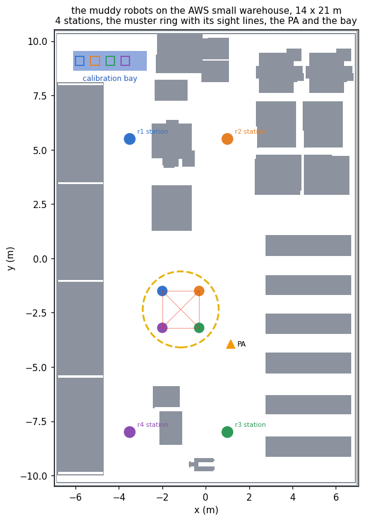

# muddy_robots_demo

Common knowledge from a public announcement of something every robot already
knows.

At the end of a shift N robots meet at a muster point in the AWS small
warehouse. Each carries a status lamp on its mast, lit by the fleet's
diagnostics when its calibration has drifted, and every robot sees every other
robot's lamp and not its own. A supervisor says over the public address that at
least one of them is faulty. Then a bell rings, and at each ring every robot
that knows it is faulty leaves for the calibration bay; every robot sees
whether anyone left. The goal is that every robot knows whether it is faulty.

This is the muddy children puzzle (Littlewood, 1953; Fagin, Halpern, Moses and
Vardi, 1995), and it is the counterpart of `coordinated_attack_demo`. There a
public signal supplies the common knowledge that no private message can. Here
a public announcement supplies common knowledge of a fact that every robot
already knows when two or more lamps are lit, and that is what makes the bells
informative: without it no robot ever learns its own lamp, however many times
the bell rings.

```
ros2 launch muddy_robots_demo muddy_robots_launch.py                  # public address, r1 r2 r3 lit
ros2 launch muddy_robots_demo muddy_robots_launch.py faults:=r2       # one lamp lit
ros2 launch muddy_robots_demo muddy_robots_launch.py floor:=silent    # no public address
bash tools/validate.sh                                                # seven checks, no simulator
python3 tools/muster.py --robots 4 --out /tmp/muddy                   # the domain and both floors
python3 tools/trace.py --task /tmp/muddy_robots_validate/n4/pa/pa-n4.json --faults r1 r2 r3 --bells 4
python3 tools/check_floor.py --robots 4 --plot docs/floorplan.png
```

## The floor

The floor is the AWS RoboMaker small warehouse, the world of the
robot-warehouse demonstrations, unchanged. `tools/make_world.py` adds a muster
ring painted on the open floor, a calibration bay with a place for each robot
in the north-west room, and a public-address mast with a horn and a lamp. All
of it is visual and none of it collides, so the floor plan
`warehouse_scenario` rasterises from the world's collision meshes is still the
floor plan.

<p align="center">
  <br>
  <sub><b>Figure 1.</b> The floor plan with four robots. The muster point is the
  largest open circle on the floor, 3.6 m of clearance; the robots stand on a
  ring of 1.2 m about its centre, facing in. Each robot's station, where it
  starts and returns to, is at the end of the west or the middle corridor.</sub>
</p>

The domain makes two claims about the floor, and `tools/check_floor.py` tests
each on the plan before anything runs, by casting rays over the occupied cells
or flooding the free ones:

| claim | what depends on it |
| --- | --- |
| on the muster ring every robot has every other robot in line of sight | the initial model, in which each robot knows whether every other is faulty |
| every place a robot is sent is reachable from where it is sent from, over the plan inflated by 0.35 m | a correct policy, and the dismissal after it, are drivable |

Both hold for three, four and five robots.

## The problem

`tools/muster.py` writes the domain for N robots `r1` to `rN` and two floors
that differ in one line, whether the hall has a public address, `pa`. The atom
`faulty(i)` says that `ri`'s lamp is lit. The initial state makes common
knowledge that every robot knows whether every other robot is faulty and does
not know whether it is; that some lamp is lit is true, and not common
knowledge:

```
(:init
  (:and
    ([C. All] (pa))
    (:forall (?i ?j - agent | (/= ?i ?j)) ([C. All] ([Kw. ?i] (faulty ?j))))
    (:forall (?i - agent) ([C. All] (<Kw. ?i> (faulty ?i))))
    (or (faulty r1) (faulty r2) (faulty r3) (faulty r4))))

(:goal (forall (?i - agent) ([Kw. ?i] (faulty ?i))))
```

plank grounds this to the hypercube: the 2^N patterns of lamps as worlds,
robot `ri` relating two exactly when they differ at most in `ri`'s own lamp,
and every pattern with a lamp lit designated.

| action | type | events | observers |
| --- | --- | --- | --- |
| `announce` | public announcement | some lamp is lit; no lamp is lit, which never occurs at a designated world | everyone |
| `bell` | public sensing | `e-leave`: some robot knows it is faulty; `e-stay`: no robot does | everyone |

Two choices need a word.

* **The bell observes whether anyone left, not who.** On the floor every robot
  sees which robots drive off. The model takes less, and loses nothing: at the
  first departure every robot already knows whether it is faulty, so who left
  adds no information the goal needs.
* **Both actions take the hall as a parameter.** plank grounds an action once
  for each assignment of its parameters, and an action with none is never
  grounded. Each problem has one hall, `muster`.

### The designated worlds are not any robot's

The designated worlds are the patterns the executor cannot yet rule out: the
planner does not know which lamps are lit, and its policy branches on what the
bells show. No robot is uncertain in that way. What a robot knows is what it
knows at the actual world, the one whose lit lamps are `faults:=`. The crew
and the knowledge view evaluate a robot's knowledge there, and the mission's
verdict asks for `(Kw ri faulty_ri)`, which by the end holds at every
designated world. The first run judged knowledge across all the designated
worlds instead, and sent a robot with a dark lamp to the bay; see the defects
below.

## What the planner returns

On the floor with a public address, for four robots:

```
announce
  bell  e-leave -> done                                 one lamp lit
        e-stay  -> bell  e-leave -> done                two
                         e-stay  -> bell  e-leave -> done     three
                                          e-stay  -> done     all four
```

The policy announces and then rings the bell until somebody leaves, or until
it has rung N-1 times. On the floor without a public address there is none,
and Aletheia's knowledge relaxation proves the goal unreachable before it
searches. Measured with AO\* at one thread:

| robots | worlds | depth | leaves | expansions | time | without a PA |
| ---: | ---: | ---: | ---: | ---: | ---: | --- |
| 2 | 4 | 2 | 2 | 9 | 0.003 s | unreachable |
| 3 | 8 | 3 | 3 | 18 | 0.003 s | unreachable |
| 4 | 16 | 4 | 4 | 30 | 0.004 s | unreachable |
| 5 | 32 | 5 | 5 | 45 | 0.006 s | unreachable |
| 6 | 64 | 6 | 6 | 63 | 0.012 s | unreachable |
| 8 | 256 | 8 | 8 | 108 | 0.071 s | unreachable |
| 10 | 1 024 | 10 | 10 | 165 | 0.690 s | unreachable |

The expansions are 3N(N+1)/2 in every cell measured, which is an observation
and not a property proved here. `tools/trace.py --plan` replays the four-robot
policy and finds the goal at every designated world of each of its four
leaves, the fifteen patterns with a lamp lit between them.

## Why

The report proves each of these over the hypercube.

* **Before the announcement**, at a world with k lamps lit, "some lamp is lit"
  holds at depth exactly E^(k-1). An R_G-step changes one lamp, and the world
  with none lit is k steps away, each by the robot whose lamp it is. With
  k ≥ 2 every robot knows it, and it is not common knowledge.
* **Without the announcement no robot learns its own lamp.** Every robot
  relates each world to the one with its own lamp flipped, so no robot knows
  its lamp at any world; the bell's `e-leave` occurs nowhere, `e-stay` occurs
  everywhere, and the update leaves the model as it was. No policy exists, of
  any depth.
* **With it**, the model is the worlds with a lamp lit, and after j silent
  bells the worlds with at least j+1. There `ri` knows it is faulty exactly at
  the worlds with j+1 lamps lit and its own among them. So with k lamps lit
  the first k-1 bells give `e-stay`, the k faulty robots then know, the k-th
  bell gives `e-leave`, and after it every world left has k lamps lit and none
  is related to another: every robot knows its lamp.
* **No policy of smaller depth exists.** At the world with every lamp lit the
  goal fails until the announcement and N-1 bells.

`tools/trace.py` shows it for four robots with `r1`, `r2` and `r3` lit:

| floor | action | worlds | knows its lamp | "some lamp lit" |
| --- | --- | ---: | --- | --- |
| PA | initial | 16 | none | E^2 |
| | announce | 15 | none | C |
| | bell, `e-stay` | 11 | none | C |
| | bell, `e-stay` | 5 | r1, r2, r3: faulty | C |
| | bell, `e-leave` | 1 | all; r4: not faulty | C |
| silent | initial | 16 | none | E^2 |
| | bell, `e-stay`, four times | 16 | none | E^2 |

## On the floor

`muster_crew` owns every robot's driver, so that no two nodes ever drive one
robot, and performs both actions.

* **Assembly**, before planning: every robot drives from its station to its
  place on the ring and turns to face the centre. The model starts there.
* **`announce`**: the camera turns to the public-address mast, and 2.5 s later
  a lit lamp is spawned over it, and stays, and the supervisor speaks. The
  action lasts 8.5 s.
* **`bell`**: the node waits for the model that includes the previous update,
  finds the robots that know they are faulty at the actual world, and sends
  them to the bay, each first stepping out of the ring along its radius, one at
  a time, nearest the bay first, five seconds apart. It reports `e-leave`, or
  `e-stay` if there are none. It refuses if no model has arrived, if no
  designated world matches the lamps, or if the model says a robot whose lamp
  is dark knows it is faulty.
* **Dismissal**, after the policy: every robot does what it knows. The faulty go
  to the bay if they are not there, the others back to their stations, and a
  robot that does not know stays. The dismissal is refused if the model's
  verdict on any robot disagrees with its lamp.

On the floor without a public address the mission rings the bell N times by
hand, and expects that at the end no robot knows whether it is faulty and that
the executor reports the goal unmet.

## The recorded runs

Both floors were recorded with four robots and `r1`, `r2` and `r3` lit. The
model column gives the worlds the robots can still consider, then the patterns
the executor cannot rule out, and the depth of "some lamp is lit".

**With a public address.**

```
assembly    every robot on the ring after 16 to 25 s                       16 / 15   E^2
plan        4 policy items, 4 leaves, 0.1 s
announce    "at least one of you is faulty"                                15 / 15   C
bell        nobody knows, nobody moves -> e-stay                           11 / 11   C
bell        nobody moves -> e-stay; r1, r2, r3 now know they are faulty     5 / 5    C
bell        r1, r2, r3 leave one at a time -> e-leave;                      1 / 4    C
            in the bay after 34, 41 and 48 s
dismissal   r4 knows it is not faulty: back to its station after 20 s
```

**Without one.** No policy, after 0.2 s; the mission rang the bell four times.
Every bell gave `e-stay`, the fifteen patterns stayed fifteen, no robot learnt
its lamp, and at the dismissal every robot stayed where it was. The mission
confirmed through the epistemic state that no robot knew whether it was faulty
before it reported that as the expected outcome.

## Found on the way

* **Knowledge judged at the designated worlds.** The first run took a robot to
  know that it was faulty when it did at every designated world. After two
  silent bells `r1` knows it at the actual world and not at the one where `r2`,
  `r3` and `r4` are lit, so under that reading no robot knew, and the third bell
  reported `e-stay`. The epistemic state applies the outcome a performer
  reports, and removed every world with three lamps lit, the actual one among
  them. The model was left with all four lit, `r4`, whose lamp was dark, was
  sent to the bay, and the mission reported the goal achieved. Knowledge is now
  evaluated at the actual world, and the bell and the dismissal refuse when the
  model and the lamps disagree.
* **Three robots leaving at once.** Sent together, the three faulty robots
  drove into one another across the ring: `r1` reached the bay after 30 s, `r2`
  after 32 s and `r3` after 243 s. They now step out along the radius and leave
  one at a time: 31, 36 and 41 s in the next run.
* **A goal written as a sentence.** The policy the mission builds for the silent
  floor carried its goal as an English sentence, which the behaviour tree
  parsed as a formula. It is now the conjunction of `Kw` formulas.
* **A check that could not fail.** The mission counted a formula check the
  epistemic state could not answer as a robot not knowing, which on the silent
  floor reads as the expected outcome. Such a check now fails the mission.

## What this does not show

* Robots seeing lamps. Which lamps each robot sees is a modelling assumption,
  checked on the floor plan as a line of sight; no robot's camera is read.
* Robots reasoning for themselves. Which robots know they are faulty is read,
  at each bell, from the model the epistemic state maintains.
* A muster where some robot cannot see another. Every pair on the ring is in
  line of sight; with an occlusion the model would no longer be the hypercube.
* An announcement that can be lost. The public address reaches every robot,
  and every robot knows that it does.

## Files

| file | contents |
| --- | --- |
| `tools/muster.py` | the domain and both floors for N robots, with the action mapping and the classical model the executor runs them with |
| `tools/trace.py` | the product update, after `coordinated_attack_demo`'s, who knows its lamp after every update, and the depth of "some lamp is lit" |
| `tools/validate.sh` | grounds, solves and traces; seven checks, no simulator |
| `tools/layout.py` | the floor: the muster ring, the bay, the stations and the PA, on the AWS small warehouse |
| `tools/check_floor.py` | the two claims about the floor, checked on the plan, and the floor plan drawn |
| `tools/make_world.py` | the Gazebo world: the AWS warehouse unchanged, with the ring, the bay and the PA mast added |
| `tools/record_demo.sh` | one floor on an Xvfb display, RViz left and Gazebo right, with the mission's log beside it |
| `src/muster_crew_node.cpp` | the robots' drivers, the `announce` and `bell` performers, the assembly and the dismissal |
| `src/mission_node.cpp` | assembles the robots, asks for a policy, runs it or rings the bell by hand, dismisses them, and checks the outcome |
| `scripts/knowledge_view.py` | what each robot knows of its lamp and the depth of "some lamp is lit", drawn for RViz |
| `launch/muddy_robots_launch.py` | Gazebo, ePlanSys, the crew, the knowledge view and the mission |
| `docs/floorplan.png` | the floor plan with four robots |
