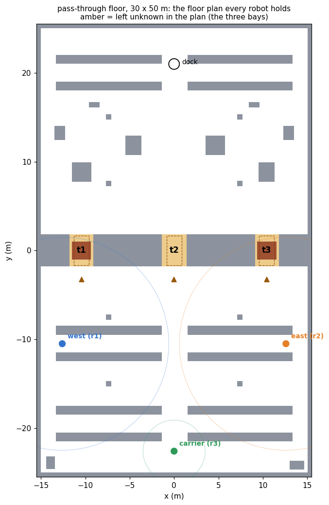

# pass_through_demo

Multi-agent epistemic planning over maps the robots build.

A racking block crosses a 30 by 50 metre hall, and the only ways from the
storage floor to the dispatch floor are three pass-through bays in it, `t1`,
`t2` and `t3`. Exactly one of them is open; the other two hold staged loads.
That much is common knowledge, and which bay is open is not. Two scouts carry
twelve-metre mapping lasers; a carrier with a 3.5 m safety scanner has to take
a load through, and may only enter a bay it knows to be open.

What an agent knows about a bay here comes from a map. A survey is read off
the scout's own SLAM map and nothing else; an exchange is one robot's knowledge
map fused into another's; and the carrier's route is a least fixed point over a
safe set that contains a bay exactly when the carrier knows the bay is open.
The film shows the case the domain exists for: the carrier crosses `t2`, a bay
no robot surveyed and no map contains, because the two scouts' maps together
rule out the other two.

```
ros2 launch pass_through_demo pass_through_launch.py              # open:=t2
ros2 launch pass_through_demo pass_through_launch.py open:=t3
bash tools/validate.sh                                             # no simulator
bash tools/record_demo.sh t2 /tmp/raw.mkv /tmp/run.log             # Xvfb recording
python3 tools/make_video.py --raw /tmp/raw.mkv --log /tmp/run.log \
        --policy /tmp/raw_policy.json --out /tmp/pass_through.mp4
```

## The problem

Agents `west`, `east` and `carrier`; bays `t1`, `t2`, `t3`. The initial model
has three worlds, all designated, with `open(t_k)` true in world `w_k` only.
Every agent's relation is total, so

    s ⊨ C_all (open(t1) ⊕ open(t2) ⊕ open(t3))
    s ⊨ ¬Kw_i open(t_k)                      for every agent i and bay k

`covers(west, t1)` and `covers(east, t3)` are static and common knowledge.
`t2` opens onto the carrier's own lane and is covered by no one, so the only
way anyone comes to know it is open is by ruling the other two out.

| action | type | events | observers |
| --- | --- | --- | --- |
| `survey(i, t)` | semi-private sensing | `e-open`: `open(t)`, `e-shut`: `¬open(t)` | `i` fully, the rest partially |
| `share-open(i, j, t)` | semi-private announcement | `K_i open(t)` | `i`, `j` fully, the rest partially |
| `share-shut(i, j, t)` | semi-private announcement | `K_i ¬open(t)` | `i`, `j` fully, the rest partially |
| `cross(i, t)` | public ontic | pre `hauls(i) ∧ K_i open(t)`, eff `delivered` | everyone |

The goal is `delivered`. Its epistemic content is the precondition of `cross`.

plank grounds this into 16 atoms and 72 ground actions. Aletheia, through the
ePlanSys plan solver, returns a policy of depth 5 with three leaves after 445
AO\* expansions:

```
survey(east, t3)
  e-open → share-open(east, carrier, t3)  → cross(carrier, t3)
  e-shut → share-shut(east, carrier, t3)
           survey(west, t1)
             e-open → share-open(west, carrier, t1)  → cross(carrier, t1)
             e-shut → share-shut(west, carrier, t1)  → cross(carrier, t2)
```

In the third leaf, after the second survey,

    s ⊨ D_{west,east} open(t2)  ∧  ¬K_west open(t2)  ∧  ¬K_east open(t2)

the pair knows `t2` is open and neither of them does. After the second
exchange `s ⊨ K_carrier open(t2)`. The crossing is public, so every agent sees
the carrier go through and the model collapses to one world.
`tools/validate.sh` grounds, solves and traces this without a simulator.

### A private announcement makes the carrier know everything

The exchanges were first written as private announcements, with the third
agent oblivious. The planner returned a policy of depth 4 in which the carrier
crosses `t1` after being told only that `t3` is shut, and the validator
accepted it.

The trace shows why. An agent oblivious to one exchange goes on believing the
speaker knows nothing; told afterwards that the speaker does know, it has no
world left that agrees with what it has just heard. Its relation at the
designated worlds is empty, a box over an empty relation holds of anything,
and `K_carrier open(t1)` held. Letting the third agent observe that an exchange
took place, without observing its content, keeps every relation serial and the
model S5, and the policy above is what comes back.

## Knowledge from maps

Each robot runs its own slam_toolbox, remapped off `/map` so three mappers do
not write one map, which would make every observation public.
`knowledge_map` keeps two grids on the floor plan's geometry:

| grid | what it holds | what reads it |
| --- | --- | --- |
| `own_map` | the robot's SLAM map, resampled | `survey`: a sensing action is the agent looking |
| `known_map` | `own_map` fused with every map the robot has been sent | navigation, and the exchange check |

A bay's reading uses the quantifier `plansys2_epistemic_perception` uses:
blocked when any cell of its corridor is occupied, clear when every cell of it
has been observed free, undecided otherwise. The corridor is the bay less the
navigation's 0.35 m inflation from each wall: a cell no route can use says
nothing about whether the bay can be crossed.

An exchange is `epistemic_slam::fuse` of the sender's knowledge map into the
receiver's, through the `epistemic_msgs/AbsorbMap` service. The reply counts
the cells the receiver newly holds, over the grid and inside each bay, and the
performer then checks the receiver's map against the announcement: a load in
the bay after `share-shut`, the corridor observed free after `share-open`, or,
when the sender knew by elimination, nothing at all, which it says in the log.

## The route is the precondition

`cross` drives the carrier along

    W    = µZ.(dock ∨ (Safe_carrier ∧ ◇Z))
    Safe = ⟦ free ∨ ⋁_t (t ∧ K_carrier open(t)) ⟧

evaluated at every (cell, world) of the model the epistemic state publishes,
by `mu_path_planner`'s own formula evaluator, with each bay as a zone. `free`
reads the floor plan outside the bays and the carrier's knowledge map inside
them. A bay the carrier has observed free is safe by the first disjunct; a bay
it knows is open without having seen it is safe by the second, and RViz draws
those cells in cyan. A bay it does not know about is in neither.

So the knowledge precondition holds twice and by independent roads. The
executor checks `K_carrier open(t)` against the model before dispatching
`cross`, and the route exists only because the safe set contains the bays the
carrier knows to be open. Until the last exchange the carrier is not in `W`,
which is published once a second as a region: it stops at the racking.

`mu_path_planner::mu_reach` computes this by Kleene iteration, recomputing the
backward image of all of `Z_k` at every step, which over a 310 × 510 grid is
tens of seconds. `least_fixed_point` evaluates the same fixed point
semi-naively, one visit per cell; `test_reach` checks the region and the
iteration count against `mu_reach` on sixty random floors.

## The recorded run

`open:=t2`, recorded on a 3840 × 1080 Xvfb display with Gazebo on the left
half and RViz on the right, composed by `tools/make_video.py` into a 162 s
film. Every figure below is a line the run wrote:

```
policy with 9 nodes, 3 leaves, in 0.2 s
carrier not in W(dock): |W| = 51 428 cells after 327 iterations
survey(east, t3)   own map: 168 of 578 cells observed, 37 occupied -> e-shut
                   M ⊗ E: 3 worlds, 2 designated
share-shut(east, carrier, t3)   16 749 cells newly known to the carrier, 163 in t3
survey(west, t1)   own map: 144 of 578 cells observed, 17 occupied -> e-shut
                   M ⊗ E: 3 worlds, 1 designated;  D{west,east} open(t2)
share-shut(west, carrier, t1)   16 707 cells newly known to the carrier, 144 in t1,
                                0 in t2;  K_carrier open(t2)
carrier in W(dock): |W| = 98 818 cells after 582 iterations; lifted by K: t2
cross(carrier, t2)  route 43.1 m through t2, at the dock after 90 s
                    M collapses to 1 world
```

The panel under the two views carries the policy with the node being
executed marked, the step in the notation above, and the table of what each
agent knows, including `D{west,east}`. RViz draws each agent's knowledge map in
its colour, a tile per agent on each bay in the colour of its answer, the map
exchanges as a line from sender to receiver, and the carrier's winning region.

## Three worlds, three leaves

The worlds differ by which two bays hold a load and by nothing else. Each runs
one leaf of the one policy, headless, to the goal:

| `open:=` | the scouts read | exchanges | the carrier's route | to the dock | model at the end |
| --- | --- | --- | --- | --- | --- |
| `t3` | east: t3 clear, 578 of 578 cells | `share-open(east, carrier, t3)` | 60.6 m through t3, observed free | 112 s | 1 world |
| `t1` | east: t3 blocked; west: t1 clear, 578 of 578 | shut t3, open t1 | 60.7 m through t1, observed free | 115 s | 1 world |
| `t2` | east: t3 blocked; west: t1 blocked | shut t3, shut t1 | 43.1 m through t2, lifted by `K` | 83 s | 1 world |

A load decides its bay from the mouth, from the first occupied cell. An open
bay does not: from the standoff the scouts saw 471 and 453 of its 578 corridor
cells, moved in until they had seen all of them, backed out, and parked.

In the first two worlds the bay the carrier crosses is in its knowledge map,
observed free, and the formula lifts nothing: the first disjunct suffices. In
the third the exchanges carried no cell of t2 at all, and t2 is safe by the
second disjunct only. It is the only world in which a robot drives through a
bay no map contains.

In the `t1` world the carrier's own map, from its 3.5 m scanner, read t1 as
blocked while the carrier was inside it. The carrier reached the dock all the
same, and the cause has not been traced.

## The floor

`tools/layout.py` holds it, and the world, the floor plan, the regions, the
robots' poses and the camera shots are all written from it.
`tools/make_floorplan.py` checks, before it writes anything, that the carrier
cannot reach the dock while no bay is known, that it can through each bay once
that bay is, that a load closes its bay, and that each scout reaches its bay's
mouth and its parking place. With `--models` it also slices every placed
model's collision mesh at laser height and requires it to lie inside the box
the plan draws for it.

<p align="center">
  <br>
  <sub>The floor plan every robot holds. Amber is what it leaves unknown:
  the three bays.</sub>
</p>

## What went wrong on the way

**The shelves stood a quarter turn from the plan.** The AWS shelf footprint was
first taken from `warehouse_xl_rmf_demo/config/aws_footprints.json`, which gives
ShelfD as 0.88 × 2.613 × 3.918. The collision mesh, read with its node
transform and its centimetre unit, is 3.918 × 0.88 × 2.64: the table permutes
the axes. Every unit was therefore a north-south column where the plan drew an
east-west bar, the racking block was a row of columns with 1.7 m gaps, and the
lasers saw between them. It was found in the `t1` world, where the carrier
stopped 0.35 m short of the south end of a column the plan said was not there.
The mesh check above now rejects that layout, naming the same extent. The
table is used unchanged by `warehouse_xl_rmf_demo`, and has not been corrected
there.

**A scout pinned at the end of its aisle.** The first rows on the corrected
geometry left 1.2 m between the aisle ends and the wall. A scout leaving its
aisle there cut the corner of the row, its laser saw the rack 0.3 m ahead,
and it stood there until the run timed out. The lane is 3 m now, which leaves
1.7 m; shortcuts are taken against the safe set less a cell; and a robot the
laser has held for two seconds backs off and plans again.

**Clear needs every cell.** With the corridor margin at 0.30 m a scout at the
mouth of an open bay saw 678 and 608 of 714 cells, and never decided. A scout
that stays undecided now moves in along the bay's axis over floor its own map
already shows free, then backs out and parks two metres along the block, off
the carrier's approach.

**Unknown was written as free.** The floor plan writes unknown as grey 205,
an occupancy of 0.196. With a free threshold of 0.25 it reads back as free,
and the bays come back open in every robot's floor plan. The threshold is
0.196, as map savers write it.

**A float32 resolution.** A map's resolution crosses a message as a float32,
so 0.1 arrives as 0.100000001, and a geometry check at 1e-9 refused every
exchange as "not on this robot's grid".

**Two clocks.** A default-constructed `rclcpp::Time` is on the system clock
and `now()` on ROS time; subtracting them throws, from inside the performer's
first control step.

**The camera stayed on a shot.** Driven at 25 poses a second, the Gazebo view
held two fixed shots for a minute and then stayed on the second for the rest
of the run, while `chase_camera` logged that it was publishing chase poses
behind the carrier. The same switch worked in isolation. gzclient under the
software renderer draws four or five frames a second, and the likeliest reading
is that the poses queued faster than it took them; it was not established.
With poses sent at 5 Hz, and a fixed shot once a second, every cut landed.
