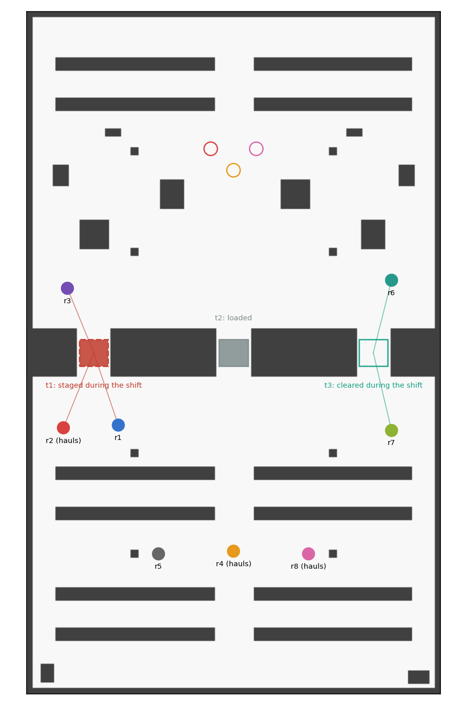

# stale_map_demo

Maps that go stale, for a fleet of eight, and the exchange of maps as an
epistemic action.

Every robot of the fleet holds the same map of the pass-through floor at the
start of the shift. During the shift a forklift stages a load in bay `t1` and
takes the load out of `t3`. A robot's laser sees a change only when its
station has a sight line into the bay, and no robot's station sees both. Every
other robot keeps the static-world assumption its occupancy map is built on:
it maps the change onto nothing having changed, and its map goes stale
without the robot knowing. After the forklift eleven entries of the eight
maps are false and no robot holds a current map of both bays. Three haulers
must then take loads through the racking, and a hauler crosses a bay only if
the bay is open and its map says so.

What a map sent from one robot to another should do to the receiver's depends
on what the receiver believes the sender saw. A reading that contradicts the
receiver's map is news that the bay changed when the sender saw a change the
receiver missed, and is a stale reading to be ignored when the receiver saw a
change the sender missed. The domain makes that distinction with a belief
about a belief, and the planner uses it to send three maps where a fleet that
shares every map sends 168.

```
ros2 launch stale_map_demo stale_maps_launch.py                    # fleet:=epistemic
ros2 launch stale_map_demo stale_maps_launch.py fleet:=fuse         # also overwrite, recency
bash tools/validate.sh                                               # eight checks, no simulator
python3 tools/fleets.py                                              # what each fleet will do
python3 tools/fleets.py --transient                                  # the same, observers gone
python3 tools/scaling.py --robots 8 16 32 64 --seeds 1 2 3           # fleets of many robots
python3 tools/check_floor.py --maps maps --plot docs/floorplan.png   # the floor's claims
bash tools/record_demo.sh epistemic /tmp/raw.mkv /tmp/run.log        # Xvfb recording
```

## The floor

The hall, the racking block and its three bays are `pass_through_demo`'s,
imported from its `layout.py`. `tools/layout.py` stations the eight robots,
and `tools/check_floor.py` tests the domain's claims on the floor plan before
anything runs, by casting rays over the occupied cells with the other robots
standing at their stations, or by flooding the plan inflated by 0.35 m:

| claim | what depends on it |
| --- | --- |
| a staged load is in view of a station with at least fifteen of its cells, or with none; a cleared bay is in view with every cell the load covered, or with none | the observability of the forklift's two actions: `t1` is seen by r1, r2 and r3, `t3` by r6 and r7, and the change is read on every observer's map and on no other |
| a hauler whose map is current reaches its drop through `t3` and no other bay; with the shift map, through `t1` | a stale map sends a hauler the wrong way, and a current one the right way |
| every station and drop is free and reachable from every hauler | the runs can be driven |

<p align="center">
  <br>
  <sub><b>Figure 1.</b> The floor. t1, dashed, is staged during the shift; t3,
  outlined, is cleared; t2 holds its load throughout. A line joins a station
  to each change it sees. r2, r4 and r8 haul; their drops are the rings north
  of the block.</sub>
</p>

The two changes are not seen by the same robots, and the haulers see
different things: r2 sees `t1` staged and not `t3` cleared, so its map shows
no bay open at all; r4 and r8 see neither, and their maps send them to `t1`.

## The domain

`tools/stale_maps.py` writes the domain and four floors for any fleet; the
eight-robot floor is in `epddl/`, with two action types of its own in
`epddl/maps.epddl`.

| action | type | events | observers |
| --- | --- | --- | --- |
| `stage(t)`, `clear(t)` | change | the change, and the forklift's slot passing with nothing changed | Fully where `sees(i, t)`, Oblivious elsewhere |
| `send-open(i, j, t)`, `send-blocked(i, j, t)` | map report | the report; the change it implies, applied where `j` believes the old state; nothing | `i` Fully, `j` Recipient, the rest Oblivious |
| `look(i, t)` | private sensing | open, blocked | `i` Fully, the rest Oblivious; only on the doubting floor |
| `cross(h, t)` | private ontic | `delivered(h)` | `h` Fully, the rest Oblivious |

The preconditions carry the epistemic content:

```
send-open(i, j, t):   B_i ¬blocked(t)  ∧  B_i B_j blocked(t)
cross(h, t):          hauls(h)  ∧  ¬blocked(t)  ∧  B_h ¬blocked(t)
```

A robot sends its map of a bay, which is what it believes, and only to a robot
it believes holds the opposite. A map is a belief of the robot that made it,
and what it carries is `B_i φ` and not `φ`.

### A received map is an update

After the forklift the model is KD45 and not S5: r4's relation no longer
reaches the actual world. Told by r6 that `t3` is open, r4 finds no world
among those it considers possible in which r6 could say so, since in all of
them `t3` is blocked and r6 believes it blocked. A plain announcement of the
reading leaves r4 with no world, believing everything: that is what fusing a
received map as a fact does to a robot whose map says otherwise. The map
report relates the report to the change it implies, applied to the worlds the
recipient believes, so r4 takes the reading as news that `t3` was cleared
since its map was made. That is an update in the sense of Katsuno and
Mendelzon, and not a revision: r4's map was right when it was made. The
action type is `false_belief_demo`'s report, generalised to a fleet with the
other robots oblivious. That demonstration lists belief revision among what
it does not show; a stale map is a case in which update, and not revision, is
the right answer, and the logic needs nothing beyond KD45 to give it.

### Who is wrong about whose map

Fifteen of the 56 beliefs the robots hold about each other's map of `t1` are
false, and twelve about `t3`. r1 saw `t1` staged and not `t3` cleared, and
believes r6's map shows `t3` blocked; it shows `t3` open. The precondition
`B_i B_j blocked(t)` is evaluated on these beliefs, and the guard holds where
it is needed: a stale reading is never sendable to a robot whose map is fresh,
because the robot holding the stale reading believes the other holds the same.

## What the logic says

`tools/validate.sh` grounds the four floors with plank, solves them with the
planner the executor uses, consistent beliefs required, and replays every
policy with `tools/trace.py`. Its eight checks:

| check | result |
| --- | --- |
| FLOOR | the floor's three claims hold |
| STALE | after the forklift the model gives every robot exactly the map its station leaves it, and 11 entries are false |
| RADIO | `clear(t3), stage(t1), send-open(r6, r2, t3), cross(r2, t3), send-open(r2, r4, t3), cross(r4, t3), send-open(r2, r8, t3), cross(r8, t3)`: maps go only to haulers, and only about `t3` |
| GUARD | `send-open(r4, r2, t1)`, r4's stale `t1` to r2, whose map is fresh, does not apply |
| COLLAPSE | a plain announcement to r4 that `t3` is open leaves r4 with no world |
| SILENT | without a radio there is no policy |
| DOUBT | robots that know maps go stale hold no false belief after the forklift, only uncertainty, and the policy sends each hauler to look at `t3` |
| RESYNC | every map brought up to date with 11 messages, one per stale entry |

The radio policy leaves eight entries stale. Nothing requires r1, r3, r5, r6
and r7 to have current maps, and the policy does not spend a message on them.
The resync floor's goal is that every map be current, and its policy sends
exactly one message per stale entry, which is the least any policy can send:
a message repairs one robot's reading of one bay.

The relay is the planner's: r6 tells r2, and r2, now believing `t3` open and
believing r4 and r8 hold the shift map's reading, tells them.

## Many robots

`tools/scaling.py` draws random fleets, each robot seeing each changed bay with
probability 0.3 and a third of them hauling, and solves the radio and resync
floors for each. Times are the planner's, on eight cores of sixteen, while
another session's simulations ran on the rest (load 10 to 14 over the
32-robot fleets, 3 at the end):

| N | haulers | seed | saw t1 / t3 | stale entries | radio: sent, time | resync: sent, time | broadcast |
| --- | --- | --- | --- | --- | --- | --- | --- |
| 4 | 1 | 1 | 2 / 0 | 6 | none in 0 s | none in 0 s | 36 |
| 4 | 1 | 2 | 2 / 0 | 6 | none in 0 s | none in 0 s | 36 |
| 4 | 1 | 3 | 1 / 2 | 5 | 0, 0.01 s | 5, 0.01 s | 36 |
| 8 | 2 | 1 | 2 / 3 | 11 | 2, 1.24 s | 11, 0.11 s | 168 |
| 8 | 2 | 2 | 2 / 1 | 13 | 2, 0.45 s | 13, 0.09 s | 168 |
| 8 | 2 | 3 | 3 / 3 | 10 | 2, 3.12 s | 10, 0.10 s | 168 |
| 16 | 5 | 1 | 5 / 8 | 19 | 2, 1.36 s | 19, 3.34 s | 720 |
| 16 | 5 | 2 | 3 / 6 | 23 | 5, 1.30 s | 23, 2.56 s | 720 |
| 16 | 5 | 3 | 6 / 2 | 24 | 4, 1.25 s | 24, 2.15 s | 720 |
| 32 | 10 | 1 | 13 / 8 | 43 | 7, 53 s | 43, 104 s | 2976 |
| 32 | 10 | 2 | 9 / 3 | 52 | 10, 54 s | 52, 87 s | 2976 |
| 32 | 10 | 3 | 8 / 5 | 51 | 9, 41 s | 51, 84 s | 2976 |
| 64 | 21 | 1 | 21 / 16 | 91 | none in 625 s | none in 635 s | 12096 |
| 64 | 21 | 2 | 12 / 24 | 92 | none in 707 s | none in 642 s | 12096 |
| 64 | 21 | 3 | 13 / 18 | 97 | none in 642 s | none in 698 s | 12096 |

Broadcast is what a fleet that sends every map of every bay to every robot
sends: N(N-1)·3. Wherever there is a policy, resync sends exactly one message
per stale entry, and radio a handful, only to haulers. A fleet in which nobody
saw `t3` has no policy, correctly: no robot can come to know that it is open.

The search does not scale as far as the counts do. From 16 robots to 32 the
time goes from about a second to about a minute, and at 64 the planner finds
no policy within 600 s on either floor. The model is not what grows: after
the forklift it has four worlds whatever the size of the fleet, one for each
pair of changes a robot can believe happened. What grows is the number of
ground actions, N(N-1)·3·2 map reports, which is 24 192 at 64 robots.

## On the floor

Each robot runs a living map (`src/living_map_node.cpp`): the shift map, every
cell known and observed at time zero, into which each scan of the robot's own
laser is cast from its pose. Evidence is kept as log-odds, a cell changing
class only past a threshold, and every cell carries the time it was last
observed. A robot's reading of a bay is the pass-through quantifier: blocked
when any cell of its corridor is occupied, clear when every cell is free. The
other robots, whose odometry is read, are masked out of every scan.

A map sent is `epistemic_msgs/OfferMap` from the sender and
`epistemic_msgs/ReceiveMap` to the receiver, carrying the region's cells and
when each was observed. The receiver merges by its rule,
`epistemic_slam::merge_cells`:

| rule | a cell both robots have settled, read differently |
| --- | --- |
| `confidence` | the reading further from 50, a tie keeping the receiver's: `epistemic_slam::fuse`'s rule |
| `overwrite` | the sender's |
| `recency` | the one observed later |

A SLAM map writes its settled cells as 0 and 100, so under the confidence rule
every contradiction between two maps is a tie, and the receiver keeps its own.
`epistemic_slam::fuse`, with which `pass_through_demo` exchanges maps, never
repairs a stale map. `test_map_fusion` has the case.

The crew (`src/crew_node.cpp`) does the four things that happen on the floor
for every fleet: the forklift's two changes, spawned and deleted in Gazebo and
checked against the floor's claim (every observer's map reads the change,
every other map is unchanged); a map sent, checked against the reading the
plan says the receiver must then hold; and a haul, with
`pass_through_demo`'s driver over the hauler's own map, through the bay the
plan names or through any bay its map shows clear. The epistemic fleet's
performers relay their actions to the crew, so every fleet's actions are
carried out by the same code.

## Four fleets

| fleet | maps sent | merged by | stands for |
| --- | --- | --- | --- |
| `epistemic` | the radio policy's | recency | the planner over the domain above |
| `fuse` | every map of every bay to every other robot, sender by sender | confidence | sharing maps with the fusion this repository has |
| `overwrite` | the same | overwrite | sharing maps, last writer wins |
| `recency` | the same | recency | sharing maps with observation times |

`tools/fleets.py` says what each will do before it runs, by replaying the
exchanges and then driving each hauler along its route over the floor plan,
its map updated wherever the route brings a change into its laser's sight.
The mission fails a run that does otherwise.

What the analysis says, and what each recorded run did:

| fleet | maps of a bay sent | over a fresh reading | stale entries after the exchanges | delivered | the model and the maps |
| --- | --- | --- | --- | --- | --- |
| `fuse` | 168 | 0 | 11 | none | no model |
| `overwrite` | 168 | 10 | 0 | r2, r4, r8 | no model |
| `recency` | 168 | 0 | 0 | r2, r4, r8 | no model |
| `epistemic` | 3 | 0 | 8 | r2, r4, r8 | agree on 24 of 24 beliefs |

The three fleets that share every map send 56 times what the plan sends. Of
those, the one with the fusion this repository has repairs nothing, and the
one whose receiver takes whatever it is sent writes a stale reading over a
fresh one ten times on the way.

With the robots that saw a change no longer looking at it
(`fleets.py --transient`), overwrite fails outright: r1, the first to send,
holds a stale `t3`, and its map cascades through the fleet. On the floor the
observers stay at their stations, read `t3` again within seconds of each
overwrite, and send it on their own turns; the overwrites are undone only
because they were still looking.

## The recorded runs

The four fleets were recorded on a 3840 × 1080 Xvfb display, Gazebo on the
left half and RViz on the right, and composed into one film. Every figure
below is a line one of the runs wrote. The forklift's changes were read on
every observer's map and on no other in every run, within 1.8 to 4 s.

```
                     fuse                       overwrite                  recency                    epistemic
after the exchanges  r1-r3 xxx, r4 r5 r8 oxx,    every map xxo              every map xxo              r2 xxo, r4 r8 oxo
                     r6 r7 oxo
r2                   no route on its map         delivered, 83 s, 43.9 m    delivered, 83 s, 43.9 m    delivered, 88 s, 46.6 m
r4                   to t1; reads the load,      delivered, 77 s, 39.9 m    delivered, 77 s, 39.7 m    delivered, 79 s, 40.9 m
                     no route; 21.3 m
r8                   to t1; reads the load,      delivered, 87 s, 43.6 m    delivered, 86 s, 43.3 m    delivered, 86 s, 43.2 m
                     no route; 14.9 m
stale at the end     9                           0                          0                          8
```

On the fuse floor r4 and r8 set off for `t1`, which their maps show open, and
each read the load with its own laser on the way and stopped with no route
on its map: `t3`, the open bay, is blocked in both. r4 reached the bay's box
before its map read the load; `fleets.py`'s route, a grid search, had it
reading the load from further back. On the epistemic floor r4 and r8 end with
`t1` still read clear on their maps: their route through `t3` never brings
`t1` into view, and the policy never needed them to know it. The mission
asked the epistemic state, for every robot and bay, whether the robot
believes the bay blocked, believes it open, or neither, and the answer agreed
with the robot's map on all 24.

## Found on the way

* **The fusion the repository has keeps every stale cell.** Read before the
  fleets were written, `epistemic_slam::fuse` settles a contradiction by
  distance from 50, which cannot order 0 and 100, and the tie keeps the
  receiver's reading. The fuse run bears it out: 168 maps sent and not one
  settled cell replaced. `test_map_fusion` now has the case, and the merge
  rules above are the result.
* **An else-if that grounds as never.** The forklift's observability was first
  one condition, `(if (sees ?j ?t) Fully else-if (doubts) Doubting else
  Oblivious)`. plank grounds the else-if branch without its own condition and
  puts that condition and its negation into the else, so every robot that did
  not see a change became doubting and none oblivious. No robot held a stale
  map, nothing was worth sending, and the planner reported the radio floor
  unsolvable at depth 2. Each change is now one action per floor.
* **A plan without its epistemic fields.** The planner plugin's `gbfs` returns
  a flat plan, and the epistemic executor then applies an action named `''` to
  the model and fails at the first step. AO\*, which returns a policy, spends
  its whole budget over 390 ground actions before depth 8. The plugin's
  `replan` returns the same eight steps as a policy in eight expansions.
* **A map that forgot the load it had just seen.** The living map first wrote
  a return as occupied and every cell a beam crossed as free. A beam grazing
  past a load's face crossed the cell the beam before it had ended in, and a
  hauler that had read `t1` blocked read it clear half a second later. Evidence
  is now log-odds, one update per cell per scan.
* **A prediction that left the observers standing still.** `fleets.py` first
  froze every map after the forklift, and predicted that under overwrite the
  first sender's stale `t3` would reach every robot and no hauler would
  deliver. On the floor r6 and r7, still at their stations, read `t3` again
  after each overwrite and sent it on their own turns; every hauler delivered.
  The floor was right. The prediction now lets an observer read its bay again
  before it sends, and the frozen version is `--transient`.
* **Another world in the recording.** Four takes showed, in the Gazebo pane,
  the static scene of a different scenario that another session was running
  on the same machine, with this floor's robots, at their own positions, and
  its staged load drawn inside it. The server was simulating this floor all
  the while: its model list was this world's, the load it deleted from `t3`
  existed, and the lasers changed exactly the maps the floor's sight lines
  say. Only what the client drew was wrong, and the runs' data are
  unaffected. The two sessions shared neither a ROS domain nor a Gazebo
  master, and only this world was advertised on this recorder's master while
  it happened. A plausible reading, not established, is that Gazebo classic's
  transport connected the client's scene request to a port the other
  session's servers, started and stopped every few minutes, had just taken.
  The recorder now compares the client's first view, the world's fixed
  opening shot, with a reference taken from a clean take, and launches again
  when it differs: 0.0 between clean takes, 65.1 for every contaminated one.
  Every take was also checked by eye.
* **A trace that doubled at every message.** `trace.py` kept every world the
  product update produced. Each map report has three events, the resync
  policy's eleven reports took the model to 6208 worlds, and a 32-robot policy
  could not be replayed. It now keeps the submodel the designated worlds
  generate, 14 worlds for the same policy, which changes no formula evaluated
  from them.

## When planning pays

The plan sends three maps where sharing sends 168; `study/` asks when that
difference is more than a count. It proves that flooding with a merge that
orders readings as they were taken does whatever any strategy can, given an
unlimited budget on a connected graph, goals over the floor alone and clocks
that agree, and measures what happens without each condition on 2400 paired
instances. On the floor, the `secret` floor makes r4 a contractor that hauls and
must not learn that `t1` was staged; four fleets ran on it:

| fleet | messages | delivered | contractor sent the secret |
| --- | --- | --- | --- |
| `flood` | 189 | r2, r4, r8 | yes |
| `flood3` | 3 | none | no |
| `pull` | 126 | r2, r4, r8 | yes |
| **`secret`**, the plan | **3** | **r2, r4, r8** | **no** |

See [`study/README.md`](study/README.md).

## What this does not show

* Localisation. Every robot's odometry is the world frame, as on every floor
  of this repository; the living map is mapping with known poses over a prior.
  A robot that did not know where it is would not know which bay it saw.
* A stale map that is wrong about the walls. The forklift changes only bay
  contents, and the driver plans outside the bays over the floor plan.
* Observation the model does not contain. A hauler's laser keeps reading the
  floor as it drives, and its map learns what it passes; the model learns only
  from actions. On the recorded epistemic run the two still agreed at the end,
  because no hauler's route brought a bay into view whose reading it did not
  already hold.
* Communication that can fail. Every map sent arrives; `epistemic_comm` is the
  lossy link.

## Files

| file | contents |
| --- | --- |
| `epddl/maps.epddl` | the change and the map report, as action types |
| `epddl/stale-maps.epddl`, `epddl/{radio,silent,doubt,resync,secret}.epddl` | the domain and the eight-robot floors, written by `tools/stale_maps.py` |
| `tools/stale_maps.py` | the domain and the five floors for any fleet, and random fleets |
| `tools/trace.py` | product update, every robot's map after every action, beliefs about each other's maps, and a plain announcement for comparison |
| `tools/validate.sh` | grounds, solves and traces; eight checks |
| `tools/scaling.py` | the radio and resync floors for fleets of many robots |
| `tools/layout.py`, `tools/check_floor.py` | the floor, its three claims, and the two maps |
| `tools/fleets.py` | what each fleet will do on the floor; on the secret floor, the protocols' sends, computed by `study/protocols.py` |
| `study/` | the communication study: the plan against flooding, pull and gossip, under four regimes |
| `tools/make_world.py`, `tools/make_mapping.py` | the Gazebo world; the action mapping |
| `tools/record_demo.sh` | one fleet on an Xvfb display, on a ROS domain and Gazebo master of its own; the film composer is kept out of the repository |
| `src/living_map_node.cpp` | one robot's map, kept current by its laser and by the maps it is sent |
| `src/crew_node.cpp` | the forklift, the exchanges and the hauls, for every fleet |
| `src/relay_action_node.cpp` | the epistemic fleet's performers |
| `src/mission_node.cpp` | runs a fleet, judges it, and sets the model against the maps |
| `scripts/knowledge_view.py` | every robot's map of the bays against the floor, and the model's row, for RViz |
| `launch/stale_maps_launch.py` | Gazebo, the living maps, the crew, the view, the mission, and ePlanSys for the epistemic fleet |
