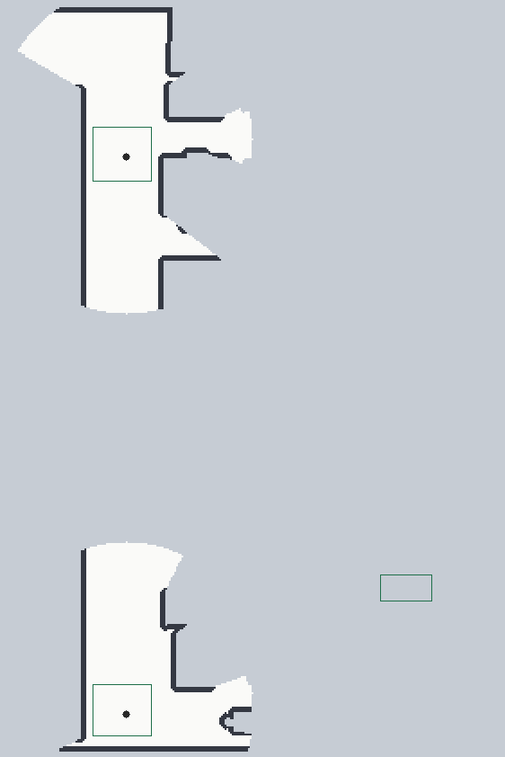
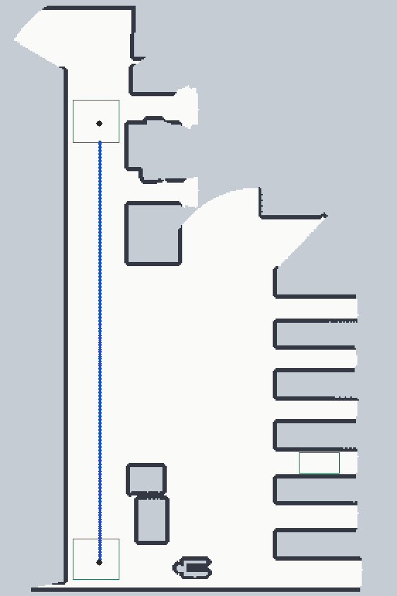

# The warehouse scenario

The floor is the one the RoboticsAcademy [multi-robot Amazon warehouse
exercise](https://jderobot.github.io/RoboticsAcademy/exercises/MobileRobots/multi_robot_amazon_warehouse/)
runs on: AWS RoboMaker's small warehouse world. Not a drawing that resembles
it — that world's own geometry, at that world's own coordinates.

What that exercise asks for is a centralised task planner that assigns the
jobs. What it never asks is how a robot comes to *know* where the pallet is,
or what a robot should do about a part of the floor it has never seen. Both
questions are the subject here, and both are answered on the map rather than
around it.

Fourteen metres by twenty-one, at five centimetres a cell: 281 x 421.

| | |
| --- | --- |
|  |  |

**Left:** two islands of white in a grey building. r1 came on shift at
shipping in the south and r2 at receiving in the north, and neither has walked
the length of the warehouse. The floor between them is not free — it is
unmeasured — so the least fixed point stops at the edge of what r1 has seen
and there is no route to receiving at all. **Right:** the same query on the
same warehouse after the sweep. Nothing else changed.

## Where the floor comes from

The two maps AWS ships beside that world are SLAM captures: sparse, noisy, and
missing most of the racks. Planning on them would make every result an artefact
of whoever drove the robot that day. So the grid is rasterised from the
collision meshes Gazebo itself uses for that world — the building shell, six
rack rows, the tall shelf on the west wall, and the clutter between them —
sliced at the heights a ground robot can hit.

```bash
python3 scenarios/warehouse/tools/rasterize_world.py
```

That writes `maps/aws_small_warehouse.pgm` for rviz and nav2, and the run
lengths the scenario library carries with it. Both are checked in, so nothing
in the build depends on the script or on the AWS package being installed. Run
it again after upgrading that package; the diff is the floor moving.

The building is what a laser measures. The grid the fixed point plans on is
that building grown by the robot's radius, and the difference is not cosmetic:
the racks stop 0.15 m short of the east wall, which to a planner that treats a
robot as a point is a corridor running the length of the rack block and joining
every aisle to every other. Routes down it are routes no TurtleBot could drive.
Growing the obstacles by 0.105 m closes it and leaves 0.7 m of each aisle.

## The two stages

Neither stage is painted on. Each is ray cast: the set of cells a laser
standing where the fleet has stood could actually have returned, cast against
the building at the 3.5 m range of the TurtleBot3's LDS. What separates the two
is only where the fleet has been.

| grid | what has been measured | free | unknown |
| --- | --- | ---: | ---: |
| `stage_a` | each robot has looked around its own end of the building | 15793 | 100250 |
| `stage_b` | and then the sweep: up the west corridor, along the south wall, up the service lane | 50570 | 61441 |

Neither stage has seen everything — after the sweep the cluttered north-east is
still unread — which is the point. A map is what has been measured, not what
is there.

| snapshot | what the robots know |
| --- | --- |
| `docks` | nothing in dispute: one world, both docks and aisle 4 grounded on the map |
| `pallet` | the pallet is in the bay in aisle 2 or the one in aisle 3, and r1 cannot tell which: the zone has one extent in `w0` and another in `w1` |
| `fleet` | the same disagreement, plus r2, whose relation is the discrete partition — r2 has driven the lane past both mouths and tells the worlds apart |

## The cases

```
case                    goal   known  disputed sensing  region   iters  path   look
unknown-is-not-free     960    960    0        0        9347     90     0      0
after-sensing           960    960    0        0        50570    487    297    0
ontic-pallet            336    0      672      0        50570    427    280    0
epistemic-pallet        336    0      672      2523     50570    397    214    1
second-robot-knows      336    336    0        336      50570    427    305    0
safety-behind-the-link  392    392    0        0        50570    499    206    0
```

Four things worth reading off that table.

**`unknown-is-not-free` against `after-sensing`.** Same robot, same goal, the
same 960 goal cells — and those cells are *known free* in both, because r2 has
been standing in them the whole time. The winning region is 9347 cells in the
first and the whole measured floor in the second, and the route goes from
nothing to 297 cells. The difference is a corridor's worth of floor having been
driven. Note which way round this is: the goal was never in doubt, the way
there was.

**`ontic-pallet` against `epistemic-pallet`.** Same map, same snapshot, same
zone; the goals differ in whether the robot has to *know* it arrived. The ontic
query drives 280 cells into the aisle the designated world puts the pallet in
and settles nothing — 672 cells stay in dispute and the robot could not say
which aisle it is standing in. The epistemic query stops 66 cells earlier, on the
service lane at (2.12, -4.22) — the mouth of aisle 3, and the nearest cell from
which the question is decidable — and spends its one look there instead.

**`second-robot-knows`.** The same epistemic goal for r2, who can tell `w0`
from `w1`. Nothing is in dispute, 336 goal cells are already known to be goal
cells, no sensing waypoint is produced, and the route runs all the way into the
bay — r2 drives to the pallet because r2 already knows which bay it is in.
Knowing already is cheaper than finding out.

**`safety-behind-the-link`.** The safety constraint is `free ∧ link_up`, a
formula evaluated against the model rather than a mask over the map. With the
link up it is every measured free cell; take the link down — the test does —
and the safe set is empty, so there is no route rather than a longer one.

## Running it

```bash
colcon build --packages-select epistemic_msgs mu_path_planner warehouse_scenario
bash scenarios/warehouse/run_demo.sh
```

That writes the floor and the snapshots, answers every case offline, puts the
same cases to a running `mu_path_planner_node` over topics, and draws both.
The driver answers each case twice — once through the node and once in
process — and fails if the two disagree.

| executable | what it does |
| --- | --- |
| `make_maps` | writes `stage_a` and `stage_b` as PGM plus YAML, and the three snapshots as JSON |
| `run_offline` | resolves every case and takes the fixed point, with no ROS in the way |
| `scenario_driver` | publishes each case's map, snapshot and query, and checks the answer against the offline one |
| `render_scenario` | draws every result over the floor it was computed on |

The scenario is also asserted rather than looked at:

```bash
colcon test --packages-select warehouse_scenario
```

Twelve tests, and the ones worth reading are the ones about the floor: that the
rack rows are where the world puts them, that a cell behind a rack is not
observed from in front of it, and that the strip behind the racks is open on
the building's plan and shut on the planner's.

## What the wire changed, twice

Two defects showed up only because the same question was asked both ways, and
both are fixed in `mu_path_planner`:

**A pose landed in a different cell depending on where the map came from.**
`OccupancyGrid.resolution` is a float32, so a metric pose over `0.05 m/cell`
arrives a hair under an integer number of cells and floors one short, while the
same map built with a double gives exactly the right cell. `GridInfo::cell_at`
now snaps a quotient that is within a relative millionth of an integer, which
is far below half a cell and well above the float32 error — and the error is
relative, so the tolerance is too: a fixed one placed a robot near the origin
correctly and left one at the far wall a cell short.

**Answers were read as answers to the wrong question.** A planner left running
from an earlier session answers these queries too, and every subscriber reads
its answers as its own. The node now stamps a path with the stamp of the query
it answers, and publishes on `/mu_planner/status` which map and which snapshot
it is currently holding — by content hash, so a driver can wait until the
planner has actually taken what it just sent instead of sleeping and hoping.

## The domain over the same warehouse

`epddl-workspace/robot-warehouse/` is this warehouse at the other altitude:
zones rather than cells, and knowledge rather than routes. The zone graph is
the building's own — shipping and receiving at the two ends of the west
corridor, the service lane along the rack fronts, and the two candidate aisles
off it, with no edge between them, because there is no way through.

```bash
bash epddl-workspace/robot-warehouse/validate.sh
```

That runs two instances and two rejections, and prints for each the pointed
model it starts from, the goal, the actions the plan uses with their events and
preconditions, and the policy the planner returned. Written up in
[`epddl-workspace/robot-warehouse/README.md`](../../epddl-workspace/robot-warehouse/README.md).
